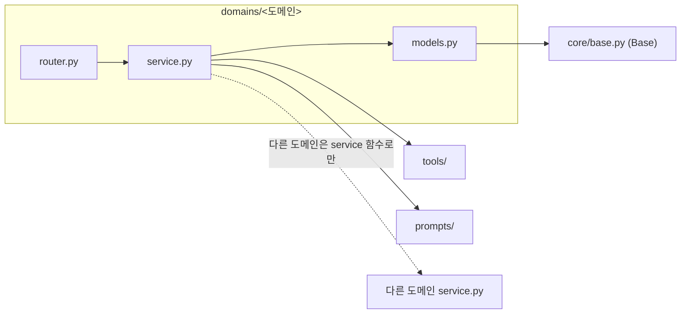

# 백엔드 규칙

루트 `CLAUDE.md`의 하드룰이 먼저입니다. 여기엔 백엔드에만 해당하는 것만 둡니다.

## 1. 구조 — 도메인 슬라이스

```
backend/
├── main.py              # FastAPI 앱 생성 + 라우터 등록만
├── celery_app.py        # Celery 인스턴스
├── core/
│   ├── base.py          # SQLAlchemy DeclarativeBase (DB 연결과 분리)
│   ├── database.py      # engine, SessionLocal, get_db
│   ├── config.py        # Pydantic Settings
│   └── exceptions.py    # 공통 도메인 예외
├── domains/<도메인>/
│   ├── router.py        # 요청 검증 + 서비스 호출 + 응답 변환만
│   ├── service.py       # 비즈니스 로직 (게이트·판정·비식별화)
│   ├── models.py        # SQLAlchemy ORM
│   ├── schemas.py       # Pydantic 요청·응답
│   └── tasks.py         # Celery task (필요한 도메인만)
├── prompts/             # 프롬프트 .md
├── tools/               # 에이전트 tool
├── alembic/
└── tests/<도메인>/
```

도메인: `auth` `organization` `face` `media` `agents` `documents` `audit`

<!-- 09/11 멘토 리뷰(YAGNI): 필요해지는 시점에 파일을 만든다. 빈 .py를 미리 깔지 않는다. -->

**의존 방향**



<!-- 도메인 간 화살표를 그리지 않은 이유: 어느 도메인이 어느 도메인을 부르는지 아직 정해지지 않았습니다.
     실제 호출이 생기면 그때 이 그래프에 채웁니다. 미리 그리면 그것도 YAGNI 위반입니다. -->

- `router`에 비즈니스 로직을 쓰지 않습니다.
- `service`는 `Request`·`Response`를 모릅니다 (FastAPI 의존 금지).
- **도메인끼리 직접 import하지 않습니다.** 다른 도메인이 필요하면 그쪽 `service` 함수만 호출합니다.

  ```python
  from domains.organization.models import Child        # ❌ 남의 도메인 models
  from domains.organization.service import get_child   # ✅ service 함수
  ```

- `core/base.py`의 `Base`만 import해도 DB 엔진이 뜨지 않아야 합니다. `tests/test_model_imports.py`가 이걸 검사합니다.
- 요청자 정보는 **`CurrentUser` 의존성으로만** 받습니다. 계정 테이블을 도메인에서 직접 조회하지 않습니다.
- `AccessLog`·`DeletionLog`는 **`audit` 서비스의 기록 함수로만** 씁니다. 로그 모델을 직접 import하지 않습니다.

<!-- 09/11 멘토 리뷰: import 시점에 create_engine이 실행되던 문제로 base.py 분리 -->

## 2. 코드 스타일

- 들여쓰기 스페이스 4칸, 줄 길이 100자, 문자열 큰따옴표. **Ruff 하나로** 린트+포맷 (Black/isort/flake8 안 씀).
- **모든 함수에 타입 힌트를 붙입니다.** 반환형 포함.
- 파일·모듈 `snake_case`, 클래스 `PascalCase`, 불리언은 `is_`/`has_`/`can_`.
- 주석은 한국어. 코드로 설명되는 내용은 주석 대신 이름을 고칩니다.
- TODO는 `# TODO(이름): 사유` — 이름 없으면 리뷰 반려.
- 설정은 `core/config.py`의 Pydantic `Settings`로 한 번에 읽습니다. **`os.getenv`를 코드 곳곳에 흩지 않습니다.**

## 3. 스키마와 예외

- 요청·응답은 전부 Pydantic. `dict`를 그대로 주고받지 않습니다.
- 네이밍: `ChildCreateRequest`, `ChildResponse`, `DraftListResponse`.
- **ORM 모델을 API 응답으로 직접 반환하지 않습니다.** 반드시 스키마로 변환 (내부 필드 유출 방지).
- 도메인 예외는 `core/exceptions.py`에 정의하고 전역 핸들러에서 HTTP로 변환합니다.
- `except Exception: pass` 금지. 삼켜야 하면 사유를 주석으로 남기고 로그를 남깁니다.
- 승인·동의·권한 검사 실패는 **조용히 빈 값을 반환하지 말고** 명시적 에러 코드로 올립니다.
- **에이전트(LLM) 출력은 자유 텍스트로 받지 않고 구조화된 JSON으로 받아 Pydantic으로 검증합니다.** 파싱 실패는 재시도 대상입니다.
- `tools/`는 **순수 함수**로 DB 조회만 하고 판단하지 않습니다. 판단은 LLM 또는 `service.py`의 몫입니다.

## 4. API 규약

| 항목 | 규칙 |
|---|---|
| 베이스 경로 | `/api/v1` |
| URL | 소문자 kebab-case, 복수 명사 — `/api/v1/children/{child_id}/drafts` |
| 상태 전이 | 서브리소스 — `POST /drafts/{id}/approve` |
| 시간 | **UTC ISO 8601** (`2026-09-01T04:30:00Z`). 타임존 변환은 프론트에서 |
| 필드명 | JSON도 `snake_case` (변환 레이어를 없앰) |
| ID | 문자열 UUID |
| 페이지네이션 | `?limit=&cursor=` (커서 기반) |

성공 응답은 리소스를 그대로 반환합니다. `{ "data": ... }` 래핑을 하지 않습니다.

에러는 형식을 하나로 통일합니다.

```json
{ "error": { "code": "DRAFT_NOT_APPROVED", "message": "승인되지 않은 초안은 노출할 수 없습니다.", "detail": null } }
```

- `code`는 UPPER_SNAKE_CASE. 프론트는 `code`로 분기하고 `message`는 그대로 보여줍니다.
- 400 검증 / 401 미인증 / 403 권한 없음 / 404 없음 / 409 상태 충돌 / 422 Pydantic / 500 서버.
- **BE가 계약을 먼저 냅니다.** 엔드포인트 스켈레톤 + OpenAPI를 올리면 FE가 타입을 생성해 MSW로 개발합니다.
- 응답 스키마에서 필드를 삭제·개명하면 PR 제목에 `[BREAKING]`을 붙이고 FE 리드를 리뷰어로 지정합니다.

## 5. DB

- 테이블은 snake_case 복수형(`children`, `draft_documents`), PK는 `id`(UUID, **모델에 default 지정**), FK는 `<단수>_id`.
- 시간 컬럼은 전부 `timestamptz`, **UTC로 저장**합니다. 컨테이너·DB 타임존은 `Asia/Seoul`이지만 저장은 UTC입니다.
- 상태 컬럼은 문자열 enum, 값은 소문자 snake_case (`draft`, `verified`, `approved`, `unclassified`).
- **미승인 원본은 처리 후 즉시 파기하고 `DeletionLog`를 남깁니다** (NFR-04). 영구 저장은 교사 승인본만.
- 승인본에 포함된 사진은 **졸업 후 1년**까지 보관합니다 (NFR-03). `MediaAsset.retention_expires_at` = `Child.graduated_at` + 1년.
- **`AccessLog`·`DeletionLog`는 append-only입니다.** 로그 자체에는 update·delete를 만들지 않습니다.
- 마이그레이션은 전부 Alembic. **DB에 직접 DDL을 치지 않습니다.** 파일명은 `<revision>_add_draft_documents_status.py`처럼 읽히게.
- **얼굴 임베딩은 AES 암호화 후 `bytea`로 저장하고, pgvector를 쓰지 않습니다.** 유사도는 담당 반의 재원·동의 원아만 조회해 메모리에서 계산합니다 (반당 6명 규모).

- **동의 철회(FR-22)는 한 트랜잭션 안에서** 처리합니다 — ① `ConsentRecord.revoked_at` 기록 ② `FaceEmbedding` **물리 삭제**(소프트 삭제 금지) ③ `EmbeddingLifecycleLog`에 `consent_revoked`(벡터 값 없이) ④ `DeletionLog` 기록.

<!-- 이전 규칙은 pgvector였음. 09/03 결정으로 암호화 bytea. 테크스펙 데이터모델 ② FaceEmbedding -->

## 6. 비동기 · Celery

- Celery로 보내는 것은 **LLM 호출을 포함하는 파이프라인 4~7단계만**. 로그인·목록 조회·승인·게시판은 전부 동기입니다. "혹시 느릴까봐" 큐에 넣지 않습니다.
- task는 **멱등**하게 씁니다. 같은 `job_id`로 두 번 실행돼도 결과가 같아야 합니다.
- 재시도 상한 2회, 타임아웃 60초. **상한 초과 항목은 예외를 던지지 않고 미분류함으로 보냅니다.**
- task 함수는 얇게 두고 로직은 `service.py`에 둡니다.

```python
@celery_app.task(bind=True, max_retries=2, soft_time_limit=60)
def generate_drafts(self, job_id: str, child_id: str) -> None:
    orchestrate_drafts(job_id=job_id, child_id=child_id)  # 로직은 서비스에
```

## 7. 테스트

- 유닛(pytest): service 로직 — 귀속 판정, 비식별화, 게이트
- 통합(pytest + TestClient): 엔드포인트, 권한, 상태 전이
- 파일은 `tests/<도메인>/test_<모듈>.py`. 함수명은 한국어로 상황을 적어도 됩니다 — `def test_미승인_초안은_노출되지_않는다():`
- **LLM을 실제로 호출하지 않습니다.** 응답을 픽스처로 고정해 결정적으로 만듭니다.
- **프로덕션 코드가 `tests/`를 import하지 않습니다.** 픽스처가 필요하면 테스트 쪽에서 주입합니다.

**필수 테스트 (없으면 머지 불가)**

1. 미승인 초안이 학부모 노출 API로 나가지 않는다 (H-1, FR-08)
2. LLM 요청 payload에 실명이 포함되지 않는다 (H-2)
3. 재시도 상한 초과 시 예외가 아니라 미분류함으로 떨어진다
4. 모든 열람 API 호출이 `AccessLog`를 남긴다 (NFR-05)
