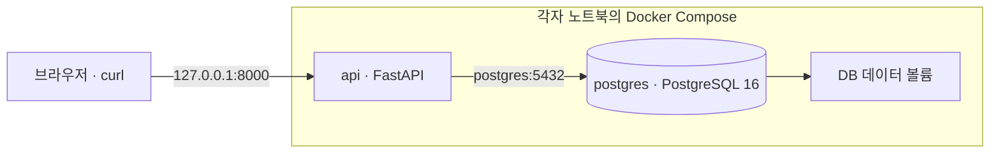

# 아이담 백엔드

아이담은 영상·사진·음성에서 수집한 맥락을 바탕으로 원아의 하루를 기록하는 AI 알림장·관찰일지 서비스입니다.

이 문서는 **처음 실행하는 팀원과 도메인 구현을 시작하는 팀원**을 위한 공통 개발 안내입니다.

> **현재 구현 범위:** FastAPI 실행, PostgreSQL 연결, 환경변수 관리, 공통 DB 세션, 헬스체크, Redis·Celery 연습 작업과 테스트.
> 현재 Compose는 **API·PostgreSQL·Redis·worker**를 실행합니다. 도메인 API·Alembic 마이그레이션·실제 AI 파이프라인은 아직 연결하지 않았습니다. AWS 서버 설치·배포는 접속 후 검증이 필요합니다.

## 바로가기

- [1. 처음 실행하기](#1-처음-실행하기)
- [2. 개발 중 사용하는 명령](#2-개발-중-사용하는-명령)
- [3. 테스트하기](#3-테스트하기)
- [4. 폴더 구조와 담당 범위](#4-폴더-구조와-담당-범위)
- [5. 공통 코드 사용 방법](#5-공통-코드-사용-방법)
- [6. 환경변수와 의존성 관리](#6-환경변수와-의존성-관리)
- [7. 브랜치와 PR](#7-브랜치와-pr)
- [8. 자주 발생하는 문제](#8-자주-발생하는-문제)
- [9. AWS 서버에서 실행하기](#9-aws-서버에서-실행하기)

## 1. 처음 실행하기

### 준비물


| 도구                         | 필요한 경우                                     |
| -------------------------- | ------------------------------------------ |
| Git                        | 저장소와 작업 브랜치 관리                             |
| Docker Desktop 또는 OrbStack | API와 PostgreSQL 실행. **앱/엔진이 실행 중이어야 합니다.** |
| Docker Compose 2.20 이상     | 루트 Compose의 `include` 지원                   |
| Python 3                   | 환경변수 파일 생성                                 |
| Python 3.12                | 호스트에서 단위 테스트 실행                            |


서버의 Python 3.12는 Docker 이미지에 포함되어 있습니다. Docker로 API를 실행할 때 호스트에 Python 패키지를 별도로 설치할 필요는 없습니다.

**아래 명령은 저장소 루트(`ktc4-chungnam-4/`)에서 실행합니다.** 현재 환경 설정이 포함된 브랜치를 먼저 받아야 합니다.

### ① 개인 환경변수 파일 생성

```bash
python3 backend/scripts/init_env.py
```

- `backend/.env.example`을 바탕으로 `backend/.env`를 생성합니다.
- DB 비밀번호를 임의로 생성하며 화면에 출력하지 않습니다.
- 예시 파일의 `POSTGRES_PASSWORD` 항목과 치환 문구를 검사하며, 누락·변경·중복 시 `.env`를 쓰기 전에 오류로 종료합니다.
- 내용이 있는 기존 `.env`는 덮어쓰지 않습니다.
- `.env`는 각자 관리하며 Git에 포함하지 않습니다.

### ② API와 DB 실행

```bash
docker compose up --build -d --wait
docker compose ps
```

`api`와 `postgres`가 모두 **healthy** 상태이면 준비가 끝났습니다. 처음 실행할 때는 이미지 다운로드와 패키지 설치로 시간이 걸릴 수 있습니다.

### ③ 접속 확인

```bash
curl --fail http://127.0.0.1:8000/health
curl --fail http://127.0.0.1:8000/health/db
```


| 주소                                          | 정상 응답 / 역할                                                              |
| ------------------------------------------- | ----------------------------------------------------------------------- |
| [서버 상태](http://127.0.0.1:8000/health)       | `200`, `{"status":"ok"}` — API 프로세스 응답 확인                               |
| [DB 연결 상태](http://127.0.0.1:8000/health/db) | `200`, `{"status":"ok","database":"ok"}` — 실제 PostgreSQL에 `SELECT 1` 실행 |
| [Swagger UI](http://127.0.0.1:8000/docs)    | 등록된 API 목록과 요청 테스트                                                      |


`/health/db`가 `503`이면 API는 실행 중이지만 DB 연결에 문제가 있는 상태입니다. 현재 Swagger에는 헬스체크 API만 등록되어 있습니다.

> Windows PowerShell에서는 `python3` 대신 `py -3`, `curl` 대신 `curl.exe`를 사용할 수 있습니다.

### 현재 실행 구조



API·PostgreSQL 컨테이너의 `TZ`와 PostgreSQL의 `timezone`·`log_timezone`은 `Asia/Seoul`로 설정합니다. 기존 컨테이너에도 적용하려면 `docker compose up -d --wait api postgres`로 재생성합니다. 이 설정은 호스트 PC나 EC2 운영체제의 타임존을 변경하지 않습니다.

각 팀원의 DB는 **각자 노트북에 따로 생성**됩니다. 로컬 DB가 팀원의 DB나 AWS DB와 자동으로 공유되지는 않습니다. PostgreSQL의 호스트 포트는 공개하지 않습니다.

팀 아키텍처 그림의 최종 개발 구성에는 호스트에서 실행하는 FastAPI·워커와 Docker의 DB·Redis가 포함됩니다. **이 README의 명령은 현재 구현된 API+DB 컨테이너 구성을 기준으로 합니다.** 실행 방식을 변경할 때 Compose와 이 문서를 함께 갱신합니다.

## 2. 개발 중 사용하는 명령

이 절의 명령은 모두 **저장소 루트** 기준입니다.


| 할 일                | 명령                                        |
| ------------------ | ----------------------------------------- |
| API 코드·의존성 변경 반영   | `docker compose up --build -d --wait api` |
| 전체 실행 / 설정 반영      | `docker compose up --build -d --wait`     |
| 컨테이너 상태 확인         | `docker compose ps`                       |
| API 로그 확인          | `docker compose logs --tail=100 -f api`   |
| DB 로그 확인           | `docker compose logs --tail=100 postgres` |
| 실행 중인 컨테이너 일시 정지   | `docker compose stop`                     |
| 컨테이너 정리, DB 데이터 유지 | `docker compose down`                     |
| 실행 전 Compose 설정 검사 | `docker compose config --quiet`           |


**현재는 코드 자동 반영과 `--reload`가 설정되어 있지 않습니다.** 코드를 수정했으면 위의 API 재빌드 명령으로 반영합니다. 로그 화면은 `Ctrl+C`로 닫아도 컨테이너가 계속 실행됩니다.

`docker compose down`은 DB 볼륨을 남깁니다. `**down -v`는 DB 데이터까지 삭제**하므로 초기화가 필요한 경우에만 사용합니다.

루트 Compose는 `backend/docker-compose.yml`을 포함합니다. `backend/`에서 Compose 명령을 실행해도 동일한 `aidam` 프로젝트를 사용합니다.

## 3. 테스트하기

### 단위 테스트 — Docker와 PostgreSQL 없이 실행 가능

먼저 `**backend/`로 이동**합니다.

```bash
cd backend
```

**macOS / Linux — 최초 1회 설치**

```bash
python3.12 -m venv .venv
.venv/bin/python -m pip install -r requirements-dev.txt
```

**macOS / Linux — 테스트 실행**

```bash
.venv/bin/python -m pytest -q
```

**Windows PowerShell**

```powershell
py -3.12 -m venv .venv
.\.venv\Scripts\python.exe -m pip install -r requirements-dev.txt
.\.venv\Scripts\python.exe -m pytest -q
```

가상환경을 활성화하지 않아도 위 명령으로 실행할 수 있습니다. 의존성이 변경된 코드를 받으면 설치 명령을 다시 실행합니다.


| 범위           | macOS / Linux 명령 (`backend/` 기준)                          |
| ------------ | --------------------------------------------------------- |
| 전체 테스트       | `.venv/bin/python -m pytest -q`                           |
| 공통 환경 테스트    | `.venv/bin/python -m pytest tests/test_environment.py -q` |
| 특정 테스트 선택    | `.venv/bin/python -m pytest -k database -q`               |
| 실패 원인 자세히 보기 | `.venv/bin/python -m pytest -vv`                          |


현재 `tests/test_environment.py`는 **6개 테스트 케이스**로 다음을 확인합니다.

- DB가 없어도 `/health`가 응답하는지
- DB 상태 API가 쿼리를 실행하는지
- DB 장애 시 내부 접속 정보를 노출하지 않고 `503`을 반환하는지
- 비밀번호 특수문자가 보존되는지
- 빈 비밀번호와 예시 비밀번호를 거부하는지

이 테스트는 SQLite와 실패 상황을 재현하는 테스트 객체를 사용합니다. 실제 PostgreSQL 연결 검증은 아래 절차로 수행합니다.

### 실제 PostgreSQL 연결 확인

**저장소 루트**에서 API와 DB를 실행한 뒤 확인합니다.

```bash
docker compose up --build -d --wait
curl --fail http://127.0.0.1:8000/health/db
```

도메인 테스트는 `tests/<도메인>/test_*.py`에 추가합니다. 성공 케이스와 함께 접근 권한, 입력 오류, DB 변경 등 해당 기능의 중요한 동작을 확인합니다.

## 4. 폴더 구조와 담당 범위

```text
backend/
├── main.py                  # FastAPI 시작점, 헬스체크
├── core/
│   ├── config.py            # 환경변수 로딩 및 검증
│   ├── base.py              # DB 설정 없이 가져올 수 있는 공통 Base
│   └── database.py          # DB 엔진, 세션
├── domains/                 # 도메인별 구현 위치
│   ├── auth/
│   ├── organization/
│   ├── face/
│   ├── media/
│   ├── agents/
│   ├── documents/
│   └── audit/
├── tools/                   # AI 도구 구현 위치
├── prompts/                 # AI 프롬프트 구현 위치
├── tests/                   # 공통 환경 및 도메인별 테스트
├── scripts/                 # 환경변수 생성, Ubuntu 준비, Celery 연습
├── alembic/                 # 마이그레이션 예정 위치
├── celery_app.py            # Celery 공통 설정과 연습 작업 등록
├── Dockerfile
├── docker-compose.yml
├── requirements.in          # 직접 사용하는 런타임 의존성
├── requirements.txt         # 설치용 고정 버전
├── requirements-dev.in      # 테스트 등 개발 의존성
├── requirements-dev.txt     # 개발 환경 설치용 고정 버전
└── .env.example             # 공유 가능한 환경변수 예시
```


| 담당      | 도메인                  | 역할                          |
| ------- | -------------------- | --------------------------- |
| A · 엄태은 | `auth` 및 공통 환경       | 로그인·인증, DB 연결·설정·통합         |
| B · 이한나 | `organization`       | 기관·반·원아·학부모 관계, 페르소나·교육계획 등 |
| C · 김동건 | `face`, `media`      | 얼굴 임베딩 관리, 미디어 업로드·메타데이터    |
| D · 정은  | `agents`             | AI 파이프라인, 작업 실행, LLM 연동     |
| E · 한상균 | `documents`, `audit` | 문서 검토·승인·열람, 접근·파기 기록       |


도메인 내부는 `models.py`, `schemas.py`, `router.py`, `service.py`를 기본으로 사용합니다. `**audit`에는 현재 `router.py`와 `schemas.py`가 없습니다.** 도메인별 상세 기능은 확정된 기능·API·ERD 명세를 따릅니다.

## 5. 공통 코드 사용 방법


| 위치           | 책임                          |
| ------------ | --------------------------- |
| `router.py`  | 요청 검증, 서비스 호출, 응답 변환        |
| `schemas.py` | Pydantic 요청·응답 구조           |
| `service.py` | 업무 로직, SQLAlchemy를 통한 DB 접근 |
| `models.py`  | 공통 `Base`를 상속한 ORM 모델       |


```text
router.py → service.py → models.py
                 └→ tools/ · prompts/  (agents 서비스에서 호출)
```

- `router.py`에 업무 로직과 DB 쿼리를 넣지 않습니다.
- `service.py`는 FastAPI의 `Request`, `Response`, `Depends`에 의존하지 않습니다.
- 별도 `repositories/` 계층을 추가하지 않습니다.
- 공통 DB 세션은 동기 방식입니다. 비동기 세션을 혼용해야 한다면 먼저 공통 코드 변경 범위를 논의합니다.

**모델에서 가져올 공통 Base**

```python
from core.base import Base
```

**라우터에서 사용할 DB 세션 의존성**

```python
from typing import Annotated

from fastapi import Depends
from sqlalchemy.orm import Session

from core.database import get_db

DbSession = Annotated[Session, Depends(get_db)]
```

라우터 함수에서 `db: DbSession`으로 받아 서비스에 전달합니다. 서비스는 저장 단위에 맞춰 `commit()`과 필요한 `rollback()`을 처리합니다. `get_db`는 세션을 생성하고 요청이 끝나면 닫으며, 자동 커밋하지 않습니다.

현재 서버 시작 시 테이블을 자동 생성하지 않습니다. Alembic은 아직 설정되지 않았으므로 `alembic upgrade head`를 실행할 수 있는 상태가 아닙니다. 모델·FK 변경은 관련 담당자와 맞추고, 마이그레이션 도입과 함께 반영합니다.

라우터 구현 후에는 `main.py`에 등록해야 Swagger와 API 경로에 노출됩니다. 실제 API 경로는 합의된 API 명세를 따릅니다.

## 6. 환경변수와 의존성 관리

### 환경변수


| 변수                  | 기본 / 예시          | 설명                                 |
| ------------------- | ---------------- | ---------------------------------- |
| `APP_NAME`          | `Aidam API`      | Swagger 등에서 사용하는 앱 이름              |
| `APP_ENV`           | `local`          | `local`, `test`, `production` 중 하나 |
| `API_PORT`          | `8000`           | 호스트에서 접속할 API 포트                   |
| `POSTGRES_HOST`     | `localhost`      | Compose 실행 시 `postgres`로 덮어씀       |
| `POSTGRES_PORT`     | `5432`           | Compose 실행 시 `5432`로 덮어씀           |
| `POSTGRES_USER`     | `postgres`       | DB 사용자                             |
| `POSTGRES_PASSWORD` | 환경변수 생성 스크립트가 설정 | 실제 값은 개인 `.env`에 보관                |
| `POSTGRES_DB`       | `ktc4`           | DB 이름                              |


`APP_ENV` 값만 바꿔도 HTTPS나 인증이 자동 적용되는 것은 아닙니다. 현재 네트워크 노출 범위는 Compose 설정으로 결정합니다.

환경변수를 추가할 때는 필요한 `core/config.py` 필드와 `.env.example`을 함께 수정하고 PR에 사용 목적을 적습니다. `DATABASE_URL` 문자열을 따로 만들지 않고 공통 설정에서 DB 연결 URL을 생성합니다.

### 패키지 추가·변경

`requirements.in`에는 앱이 직접 사용하는 패키지를, `requirements-dev.in`에는 테스트용 패키지를 작성합니다. 이후 `**backend/`에서**, `uv`가 설치된 환경으로 고정 버전 파일을 갱신합니다.

```bash
uv pip compile requirements.in --universal --python-version 3.12 --output-file requirements.txt --no-annotate --no-header
uv pip compile requirements-dev.in --universal --python-version 3.12 --constraint requirements.txt --output-file requirements-dev.txt --no-annotate --no-header
```

관련 `.in`과 `.txt` 변경을 같은 PR에 포함합니다. 런타임 의존성 변경 후에는 API 이미지를 다시 빌드하고, 개발 의존성 변경 후에는 가상환경에 `requirements-dev.txt`를 다시 설치합니다.

## 7. 브랜치와 PR

**브랜치 이름·커밋 메시지·PR 규약의 원본은 스킬 파일입니다.** 여기에 사본을 두지 않습니다 — 두 벌이 되면 한 벌이 낡습니다.

- [브랜치 만들기](../.claude/skills/create-branch/SKILL.md) — `<타입>/<파트>/<작업내용>`, `develop`에서 분기
- [커밋](../.claude/skills/commit/SKILL.md) — Conventional Commits, 커밋 분리
- [PR·리뷰](../.claude/skills/pr/SKILL.md) — 요구사항 ID, 분량, 리뷰어 지정, 리뷰 태그

Claude Code를 쓰면 `/create-branch` `/commit` `/pr`로 호출됩니다. 손으로 할 때는 위 링크를 읽으세요.
전원이 지킬 금지(=`develop` 직접 push 금지 등)는 루트 [CLAUDE.md](../CLAUDE.md) §Git에 있습니다.

### 백엔드에서만 추가로 챌 것

- **공통 파일**을 변경할 때는 BE 리드(엄태은)에게 목적을 공유합니다 — `main.py`, `core/`, `celery_app.py`, Compose, `requirements*`.
- 자신의 도메인 외 파일을 바꿔야 하면 해당 담당자와 영향 범위를 맞춥니다 (담당자는 §4).
- PR 전에 관련 테스트, `git diff --check`, `.env` 등 개인 설정 파일이 섞이지 않았는지 확인합니다.
- 새 환경변수·패키지·DB 구조 변경이 있으면 PR 본문에 적습니다. `.env.example`도 같이 갱신합니다.

## 8. 자주 발생하는 문제


| 증상                                           | 확인 및 조치                                                                    |
| -------------------------------------------- | -------------------------------------------------------------------------- |
| `Cannot connect to the Docker daemon`        | Docker Desktop/OrbStack을 실행한 뒤 `docker version` 확인                         |
| `.env` 또는 `POSTGRES_PASSWORD` 관련 오류          | `python3 backend/scripts/init_env.py` 실행. 기존 `.env`가 있으면 필요한 변수가 들어 있는지 확인 |
| `8000` 포트 사용 중                               | `backend/.env`의 `API_PORT`를 빈 포트로 바꾸고 Compose 재실행. 접속 URL도 해당 포트 사용        |
| 코드가 바뀌지 않음                                   | API 이미지 재빌드 필요: `docker compose up --build -d --wait api`                  |
| `/health`는 정상, `/health/db`는 `503`           | `docker compose ps`와 API·DB 로그 확인                                          |
| `.env` 비밀번호 변경 후 DB 접속 실패                    | 기존 DB 볼륨에는 이전 비밀번호가 남아 있음. PostgreSQL 계정과 앱 설정을 함께 맞춰야 함                   |
| 호스트의 `localhost:5432`로 DB 접속 불가              | 현재 DB 호스트 포트는 공개하지 않음. API 컨테이너는 `postgres:5432`로 연결                       |
| `ModuleNotFoundError: core` 또는 테스트 import 오류 | `backend/`에서 해당 가상환경의 Python으로 테스트 실행                                      |
| 도메인 테스트 경로에서 `no tests ran`                  | 현재 도메인 폴더에는 `.gitkeep`만 있음. `test_*.py` 작성 후 실행                            |
| 원격 저장소에서 환경 설정 브랜치가 안 보임                     | 로컬 브랜치 생성과 원격 push는 별도. 브랜치가 공유되었는지 확인                                     |


## 9. AWS 서버에서 실행하기

> **로컬 확인과 서버 배포는 별도입니다.** 설치 스크립트와 실행 설정은 준비되어 있지만, 실제 AWS 서버 상태는 접속 후 확인해야 합니다.

제공 환경은 Ubuntu 24.04, 서울 리전의 팀 공용 EC2입니다. 카테캠 포털 → 본인 팀 계정 → 서울 리전 → EC2 → 연결 → Session Manager로 접속합니다.

먼저 서버의 기존 작업 디렉터리·서비스·사용 중인 포트를 확인합니다. 배포할 브랜치의 코드를 합의한 디렉터리에 준비한 다음, **서버의 저장소 루트**에서 실행합니다.

```bash
bash backend/scripts/setup-server.sh
python3 backend/scripts/init_env.py
```

서버의 `backend/.env`에서 `APP_ENV=production`으로 설정한 뒤 실행합니다.

```bash
sudo docker compose up --build -d --wait
sudo docker compose ps
curl --fail http://127.0.0.1:8000/health
curl --fail http://127.0.0.1:8000/health/db
```

`setup-server.sh`는 Docker 공식 Ubuntu 저장소를 사용합니다. 기존 Docker가 있으면 재설치하지 않으며, 충돌 패키지가 발견되면 자동 삭제하지 않고 중단합니다. 기존 Docker에 Compose 플러그인이 없다면 현재 설치 방식에 맞춰 별도로 보완해야 합니다.

원격에 push하지 않은 브랜치는 서버에서 `git clone`으로 가져올 수 없습니다. feature 브랜치를 공유한 뒤 받거나, 비밀 파일을 제외한 배포 아카이브를 전달합니다.

**현재 API는 서버 내부의 `127.0.0.1`에만 열립니다.** 공인 IP 접속, Nginx·HTTPS, 프론트·워커 연결, GitHub Actions 자동 배포는 후속 작업입니다.


## Redis·Celery worker 따라가기 (BE A)

이번 범위는 Redis·worker 기반과 모델을 호출하지 않는 연습 작업입니다.
`domains/agents/`는 수정하지 않습니다. 실제 AI task와 service 연결은 BE D가 담당합니다.

### 읽는 순서와 파일 역할

| 파일 | 역할 |
| --- | --- |
| `core/config.py` | Redis 접수함·결과 저장 주소와 결과 만료 시간을 환경변수에서 읽음 |
| `.env.example` | 새 설정의 이름·예시·단위 안내. 실제 `.env`는 덮어쓰지 않음 |
| `celery_app.py` | Celery 앱 생성, 작업 모듈 등록, 상태·직렬화·시간대 설정 |
| `scripts/celery_smoke.py` | 연습 함수와 접수·조회·자동 검증 CLI |
| `docker-compose.yml` | 같은 백엔드 코드로 API와 worker를 각각 실행하고 Redis 연결 |
| `.dockerignore` | 기존 scripts 제외 규칙에서 celery_smoke.py만 이미지에 포함 |
| `requirements.in` | celery[redis] 직접 의존성 추가 |
| `requirements.txt`, `requirements-dev.txt` | uv pip compile로 설치 버전 고정 |
| `tests/test_celery_smoke.py` | 정상·의도한 실패·잘못된 입력·대기 범위 검사 |

### 1. 설정: 접수함과 결과 저장 공간

- `CELERY_BROKER_URL`: 작업 메시지를 보낼 곳. Compose에서는 `redis://redis:6379/0`.
- `CELERY_RESULT_BACKEND`: 실행 상태와 반환값을 읽고 쓸 곳. Compose에서는 `redis://redis:6379/1`.
- `/0`과 `/1`은 같은 Redis 서버 안의 논리적 DB 번호입니다. 별도 Redis 두 대가 아닙니다.
- `CELERY_RESULT_EXPIRES`: 기본 86400초(1일). 연습용 결과 만료 설정이며 실제 문서 보관 정책과 다릅니다.
- 기존 `.env`에 새 항목이 없어도 기본값으로 실행됩니다. 다른 주소가 필요하면 설정을 추가합니다.
- `.env.example`의 localhost는 별도 로컬 Redis용입니다. 현재 Compose는 Redis 포트를 호스트에
  공개하지 않으므로 아래 제출·조회 명령은 컨테이너 안에서 실행합니다.

공통 Settings는 DB 비밀번호를 요구하므로 `init_env.py`로 `.env`를 준비합니다.
AI 키는 기본값이 빈 문자열이어서 없어도 연습 가능합니다. 실제 AI 호출에는 유효한 키가 필요합니다.
이 연습은 DB·AI를 호출하지 않습니다.

### 2. Celery 앱과 worker는 무엇이 다른가?

`celery_app.py`의 Celery 객체는 접수자와 worker가 공유하는 설정입니다.
이 파일을 import하는 것만으로 worker가 실행되지는 않습니다.

Compose의 worker 명령은 다음과 같습니다.

```bash
celery -A celery_app:celery_app worker --loglevel=INFO --concurrency=1
```

- `-A celery_app:celery_app`: celery_app.py 안의 celery_app 객체를 사용.
- `worker`: Redis를 감시하다가 받은 작업을 실행하는 프로세스 시작.
- `--concurrency=1`: 작은 팀 서버를 고려한 초기값. 한 번에 작업 하나 실행.
- API와 worker는 같은 Dockerfile의 코드를 사용하지만, 실행 명령과 프로세스가 다릅니다.
- worker는 Redis의 healthcheck 통과 후 시작합니다. 연습에 DB가 필요하지 않아 postgres는 의존하지 않습니다.

Celery 앱은 `scripts.celery_smoke`만 등록합니다. 비어 있는 실제 AI 작업이 성공으로 처리되는 것을
피하기 위해 `domains.agents.tasks`는 아직 등록하지 않습니다. D의 작업 구현 후 include 목록에
추가하는 연결 작업을 함께 진행하면 됩니다.

`task_track_started=True`는 STARTED 상태를 저장합니다. 메시지·결과는 JSON만 사용합니다.
Celery 시간대는 Asia/Seoul, UTC 처리는 활성화합니다. worker는 작업을 과도하게 미리 가져오지 않도록
prefetch를 1로 둡니다. 연습 작업은 60초에 soft timeout, 65초에 강제 timeout이며,
종료 시 70초 유예합니다. 이번 연습 작업에는 자동 재시도가 없습니다.

### 3. 실행하기

아래 명령은 모두 저장소의 `backend/`에서 실행합니다. EC2에서는 Docker 명령 앞에 sudo를 붙입니다.

```bash
python3 scripts/init_env.py
docker compose up -d --build redis worker
docker compose ps
docker compose logs --tail=50 worker
```

worker 로그의 등록 작업에 `aidam.practice`가 있고 `ready`가 보이면 준비 완료입니다.
코드를 수정한 뒤에는 `--build`로 이미지를 다시 만들어야 합니다. API·DB도 필요하면
서비스 이름 없이 `docker compose up -d --build`를 실행합니다.

### 4. 접수 → 조회 → 성공

```bash
docker compose exec worker python -m scripts.celery_smoke submit --delay-seconds 3
```

`{"task_id": "..."}`를 반환합니다. 출력된 ID를 다음 명령에 넣습니다.

```bash
docker compose exec worker python -m scripts.celery_smoke status --task-id 여기에-ID
```

처음에는 PENDING 또는 STARTED, 완료 후에는 다음 형태입니다.

```json
{"task_id": "...", "state": "SUCCESS", "result": {"message": "작업 완료"}}
```

`practice.delay({"message": "test"})`는 Redis에 작업을 접수하고 ID를 반환합니다.
실행 완료를 기다리지 않습니다. worker가 나중에 `practice()`를 실행하여 결과를 Redis에 씁니다.
`status()`는 `AsyncResult(task_id)`를 새로 만들어 ID만으로 조회합니다. 원래 접수 객체가 필요 없습니다.
실제 업무의 API 주소나 접수 핸들러는 이번 범위에 포함하지 않습니다.

### 5. 의도한 실패 확인

```bash
docker compose exec worker python -m scripts.celery_smoke submit --fail
```

출력 ID로 status 명령을 실행하면 FAILURE와 `Intentional practice failure`가 나옵니다.
함수가 예외를 발생시키면 Celery가 실패를 기록합니다. worker 자체는 계속 다른 작업을 처리합니다.
오류 로그가 찍히는 것은 이 테스트에서 기대한 동작입니다.

| 상태 | 뜻 |
| --- | --- |
| PENDING | 아직 결과 기록 없음. 대기 중일 수도, 없는 ID나 만료된 결과일 수도 있음 |
| STARTED | worker 실행 중 |
| SUCCESS | 정상 완료. result에 반환값 |
| FAILURE | 예외 발생. 연습 CLI는 고정 오류 메시지를 표시 |

PENDING은 접수 존재를 보장하지 않습니다. 실제 서비스의 작업 소유권·존재 확인·영구 상태·결과 저장은
BE D의 작업 모델/API에서 구현해야 합니다. Redis 결과만으로 사용자 접근 권한을 판정하면 안 됩니다.

### 6. 대기 상태를 확실히 관찰하기

빠른 작업은 PENDING·STARTED를 놓칠 수 있습니다. worker를 정지한 상태에서 접수하면 대기를 확인할 수 있습니다.

```bash
docker compose stop worker
docker compose run --rm --no-deps worker python -m scripts.celery_smoke submit
docker compose run --rm --no-deps worker python -m scripts.celery_smoke status --task-id 여기에-ID
docker compose start worker
docker compose exec worker python -m scripts.celery_smoke status --task-id 여기에-ID
```

`compose run ... python`은 작업을 제출/조회하는 일회성 프로세스이며 worker 소비자는 실행하지 않습니다.
따라서 정지 중에는 PENDING이고, worker를 다시 시작하면 저장된 작업을 처리합니다.

### 7. 자동 검증과 정리

```bash
docker compose exec worker python -m scripts.celery_smoke verify
```

실제 `.delay()`로 작업 두 개를 전송하여 STARTED, 성공 반환값, 실패와 ID 기반 조회를 검사합니다.
eager 모드에서는 오류를 내며 검증을 거부합니다. `get(timeout=30)`은 이 자동 검사에서만 결과를
기다리는 용도입니다. 실제 비동기 접수 API에서는 완료까지 기다리는 get을 호출하지 않습니다.

개발 의존성을 설치한 환경에서 함수 테스트와 기존 테스트를 함께 실행합니다.
환경변수는 공통 Settings를 충족시키는 테스트 전용 값이며 실제 AI 호출은 없습니다.

```bash
POSTGRES_PASSWORD=test-only python -m pytest
```

정리할 때는 다음 명령으로 정지합니다. 볼륨 데이터는 유지됩니다.

```bash
docker compose stop worker redis
```

Redis의 AOF와 볼륨은 컨테이너 교체에 대비한 저장 장치이며 백업을 대체하지 않습니다.
실제 AI의 장애 재시도·중복 실행 방지·재생성 횟수·미분류 처리와 업무 DB 저장은 D·AI 리더와 별도 연결합니다.

### 이번 구현의 검증 결과

- Python 3.12: 기존 16개 + 신규 9개, 총 25개 테스트 통과.
- Compose 설정 검사와 실제 worker 이미지 빌드 통과.
- 실제 Redis·worker: STARTED → SUCCESS, 의도한 FAILURE 확인.
- worker 정지 중 제출한 ID가 PENDING이고, 재시작 후 같은 ID로 SUCCESS 조회됨을 확인.
- 테스트 환경은 별도 Compose 프로젝트로 분리했으며 검증 후 worker·Redis를 정지.
- Ruff는 실행 환경에 설치되어 있지 않아 미실행. 기존 테스트 라이브러리의 폐기 예정 경고 2건 발생.
