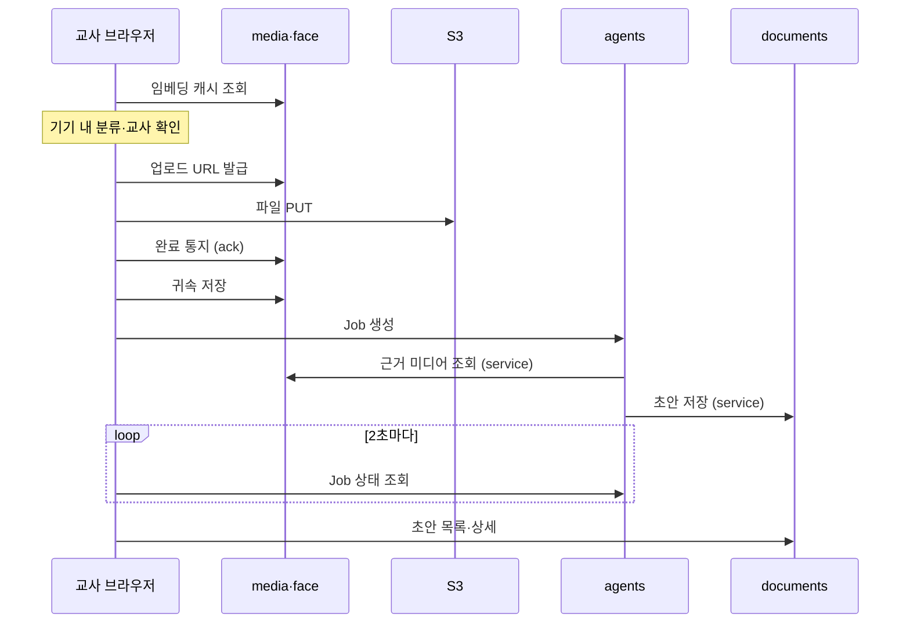

# 아이담 API 문서

> 원본은 이 폴더(`docs/api/`)입니다. 노션 "아이담 API 문서 (9.22)"는 09-28에 이 폴더로 옮기기 전 상태를 남긴 기록용 사본이라 근거로 쓰지 않습니다.

> 지금은 초안입니다. 도메인 담당이 확인해 확정하며, 확인 요청과 답은 이슈 #58과 이 폴더를 고치는 PR로 주고받습니다.

작성 송유진 · 09-22 초안 · 09-28 저장소로 옮김

## 이 문서를 읽는 법

사람과 Claude가 같은 규칙으로 읽습니다.

- **필요한 파일만 읽습니다.** 도메인마다 파일이 나뉘어 있습니다(아래 §파일).
- **원본 순서**
  1. 형식 규약(베이스 경로, 시간·날짜, 에러 모양, 공통 에러 코드, 페이지네이션)은 `docs/테크스펙.md` §공통 API 규약이 원본입니다. 이 폴더와 다르면 테크스펙이 맞습니다.
  2. BE가 구현해 `/docs`의 OpenAPI에 나온 엔드포인트는 OpenAPI가 원본입니다(테크스펙 §인터페이스 명세). 그러면 이 폴더의 해당 절은 "구현됨"으로 줄이거나 지웁니다.
  3. 그 전까지는 이 폴더가 요청·응답의 원본입니다.
- **표기**
  - **상세 작성**: 요청·응답까지 정한 엔드포인트입니다. FE 목(MSW)과 BE schemas를 이 모양으로 만듭니다.
  - **경로만**: 경로와 하는 일만 정했습니다. 이 API를 쓰는 화면이나 라우터를 만들기 전에 해당 파일에 요청·응답을 먼저 채웁니다(PR).
  - **확장(경로만)**: 상세 작성 엔드포인트에 필드나 파라미터를 더하는 것입니다.
  - `(제안)`: 이 문서에서 임시로 정한 값입니다. 써도 되지만 담당이 확정하기 전이라 바뀔 수 있습니다.
  - `[확인 필요: 담당]`, **(막힘)**: 담당이 정할 값입니다. 작업이 막히면 아래 **막히거나 정해야 할 때**를 따릅니다.
  - `임시 결정(이름)`: 작업하던 사람이 정해서 반영한 값입니다. 담당이 확정하기 전까지 바뀔 수 있습니다.
- **develop 코드와 다를 때**: 코드가 먼저 들어온 곳은 각 도메인 파일에 차이를 적었습니다(documents의 §develop 코드와 다른 점, media·face·organization의 체크리스트). 어느 쪽으로 맞출지 막히면 아래 **막히거나 정해야 할 때**를 따릅니다. 정해지기 전까지 FE 목은 이 문서를 따릅니다.
- **막히거나 정해야 할 때**
  - `[확인 필요]`·(막힘) 항목이나 develop 코드와 다른 곳 때문에 작업이 막히면, 그 작업을 하는 사람이 직접 정하고 진행합니다. 담당의 답을 기다리지 않습니다.
  - 정한 값은 **같은 PR에서 이 폴더에 반영합니다.** 해당 절의 값을 고치고, 체크리스트 항목을 `[x]`로 바꾼 뒤 `임시 결정(이름)`과 반영한 곳을 적습니다. 문서에 반영하지 않은 결정은 없는 것으로 봅니다.
  - 예: `- [x] (막힘) 역할 필드 이름: account_type vs role → 임시 결정(송유진): account_type. 반영: auth.md GET /api/v1/me 응답`
  - 담당이 확정하면서 값을 바꾸면, 그 PR에서 문서와 코드를 함께 고칩니다.
  - Claude는 값을 지어내지 않습니다. 선택지와 추천을 보여 주고, 사용자가 정한 값을 반영합니다(루트 `CLAUDE.md` §Claude 작업 규칙).
- **예시 값**: JSON 예시의 id·이름·이메일은 모두 합성이고, FE 목(`frontend/src/mocks/fixtures/`)과 같은 값입니다.
- **고칠 때**: 이 폴더를 PR로 고칩니다. 노션은 고치지 않습니다. 요청·응답을 바꾸면 FE의 `types/api-draft`와 목, BE의 schemas도 맞춥니다.

## 파일

| 파일 | 내용 |
|---|---|
| [auth.md](auth.md) | 로그인·로그아웃·내 계정, 인증 방식별 차이 |
| [organization.md](organization.md) | 교사의 반, 반 원아 명단, 학부모의 자녀 |
| [media-face.md](media-face.md) | 업로드 URL·완료 통지·귀속 저장, 재생 URL, 발화 구간, 얼굴 임베딩 캐시·등록·삭제 |
| [agents.md](agents.md) | 초안 생성 작업(Job) 시작과 진행 조회 |
| [documents.md](documents.md) | 초안 목록·상세·수정·승인, 게시, 학부모 열람. develop 코드와 다른 점 |
| [screens.md](screens.md) | 화면별로 쓰는 API, 목록에 없는 API, 화면·디자인 쪽 확인 |

## 담당

| 도메인 | 확인·보완 | 최종 확정 |
|---|---|---|
| auth | 송유진 | 엄태은 |
| organization | 이한나 | 이한나 |
| media · face | 김동건 | 김동건 |
| agents | 정은 | 정은 |
| documents (교사용) | 김진하 | 한상균 |
| documents (학부모용) | 송유진 | 한상균 |

## 공통 규약 중 테크스펙에 없는 것

베이스 경로 `/api/v1`, URL, 시간·날짜, 필드명, ID, 페이지네이션, 에러 모양, 상태 코드, 공통 에러 코드는 테크스펙 §공통 API 규약에 있고 여기 옮겨 적지 않습니다. 아래는 그 절에 없는 것이고 모두 `(제안)`입니다.

- **경로**: 라우터 경로에 도메인 prefix(`/agents`, `/documents` 등)를 붙이지 않고 `/api/v1` + 리소스 경로로 둡니다. JSON에서 반은 `class_id`로 쓰고 경로는 `/classes`입니다.
- **목록 응답**: `{ "items": [...], "next_cursor": "..." | null }`입니다. 반이나 계정 단위의 작은 목록은 `limit`·`cursor` 없이 한 번에 주고 `next_cursor`는 항상 `null`입니다. 커서를 쓰는 곳은 학부모 알림장 목록뿐입니다.
- **enum**: JSON enum 값은 소문자 snake_case 영어 코드입니다. 테크스펙의 한글 값(예: 발화없음)은 schemas의 매핑표로 연결합니다. 에러 코드와 `error_code` 값은 UPPER_SNAKE_CASE입니다.
- **에러**
  - 없는 리소스는 404 `<RESOURCE>_NOT_FOUND`(예: `DRAFT_NOT_FOUND`)입니다. 상태 충돌(409)은 엔드포인트마다 코드를 정합니다.
  - 로그인 실패는 401 `INVALID_CREDENTIALS`입니다. 로그인 화면으로 보내지 않고 폼 오류로 보여 줍니다.
  - `error.detail`은 object 또는 null로 두고, 키는 에러 코드마다 적습니다. [확인 필요: 김동건] develop `backend/core/exceptions.py`의 `AidamError.detail`은 `str | None`이고, 필드 이름(`detail`·`details`)도 `docs/open-questions.md`에 미정으로 있습니다.
  - 각 엔드포인트의 에러 목록에서는 401, 422, `ROLE_NOT_ALLOWED`를 생략합니다. 모든 엔드포인트에 해당합니다.
  - 401·403을 받았을 때 FE가 어디로 보내는지는 `frontend/CLAUDE.md` §데이터에 있습니다.
- **동시 수정과 중복 요청**: 초안 수정·승인·게시 요청에는 `expected_version`을 싣습니다. 서버 값과 다르면 수정·승인은 409 `DRAFT_VERSION_CONFLICT`이고, 게시는 200 안의 건별 `error_code`로 알려 줍니다. Job 생성과 게시는 FE가 만든 `request_id`로 같은 요청이 두 번 처리되지 않게 합니다.
- **원아 이름**: 교사 화면의 원아 이름은 organization 명단(`GET /api/v1/classes/{class_id}/children`)에서만 받습니다. agents·documents 응답은 `child_id`만 줍니다.
- **재생 URL**: 모든 도메인에서 `{media_id, type, url, url_expires_at}` 한 가지 모양입니다.
- **ID 예외**: 초안 안에서만 유일한 `evidence_id`는 UUID가 아니라 불투명 문자열입니다.
- **인증**: 세션 쿠키와 JWT 중 아직 정하지 않았습니다. 어느 쪽이든 경로·요청 본문·`/me` 응답은 같습니다. 차이는 [auth.md](auth.md)에 있습니다.
- **용어**: 루트 `CLAUDE.md` §도메인 용어를 따릅니다. 알림장은 `parent_note`(letter가 아님), 승인은 `approve`(confirm이 아님)이고, `publish`는 "학부모에게 노출"의 뜻으로만 씁니다.

## 하루 흐름과 API

상세 작성 범위에서는 교사 로그인부터 학부모 열람까지 이어지는 데모 흐름 하나만 다룹니다.

- 사진 분석과 분류 확인은 브라우저 안에서 끝납니다(H-3). 서버에 쓰는 호출은 전송 단계부터 시작합니다.
- 교사 공통 헤더는 두 호출로 그립니다. 선생님 이름은 `GET /api/v1/me`, 어린이집명과 반은 `GET /api/v1/classes`에서 받습니다.

| 단계 | 화면 | 호출 | 담당 |
|---|---|---|---|
| 1. 로그인 | 로그인 | `POST /api/v1/sessions` → `GET /api/v1/me` | auth |
| 2. 오늘의 기록 진입 | 오늘의 기록·빈 상태 | `GET /api/v1/classes`, `GET /api/v1/classes/{class_id}/drafts?record_date=`(오늘 초안이 이미 있으면 검토 화면으로), `GET /api/v1/classes/{class_id}/jobs?record_date=`(하던 작업으로 돌아가기, 경로만) | organization, documents, agents |
| 3. 자료 올리기 | 자료 올리기 | 로컬(API 없음). IndexedDB에 적재 | FE |
| 4. 적재 진행 | 오늘의 기록·업로드 중 | `GET /api/v1/classes/{class_id}/children`("· 5명". 이후 분류 단계에서도 씀) | organization |
| 5. 모델 준비 | 처리 중/모델 다운로드 | 로컬(API 없음). 정적 모델 파일 | FE |
| 6. 기기 내 분류 | 처리 중/온디바이스 분류 | `GET /api/v1/classes/{class_id}/face-embeddings` | media · face |
| 7. 분류 확인 | 얼굴 분류·결과 확인, 수동 분류/사진 | 로컬(API 없음). 결과는 8단계에서 보냄 | FE |
| 8. 서버 전송 | 처리 중/서버 전송 | `POST /api/v1/media/upload-urls` → S3 `PUT` → `POST /api/v1/media` → `PUT /api/v1/media/{media_id}/child-links` | media · face |
| 9. 초안 생성 | 처리 중/초안 생성 | `POST /api/v1/classes/{class_id}/jobs` → `GET /api/v1/jobs/{job_id}`(2초 폴링) | agents |
| 10. 초안 검토 | 초안 검토/왼쪽 원아 목록 | `GET /api/v1/classes/{class_id}/drafts`, `GET /api/v1/drafts/{draft_id}`, `PATCH /api/v1/drafts/{draft_id}`, `GET /api/v1/media/{media_id}`(URL 만료 시) | documents, media · face |
| 11. 승인 | 초안 검토/왼쪽 원아 목록(체크와 버튼) | `POST /api/v1/drafts/{draft_id}/approve` | documents |
| 12. 게시 | 전체 게시 확인 모달, 알림장 발행 완료 | `GET /api/v1/classes/{class_id}/drafts`, `POST /api/v1/publications` | documents |
| 13. 학부모 목록 | 학부모 W3 알림장 목록 | `GET /api/v1/me` → `GET /api/v1/me/children` → `GET /api/v1/children/{child_id}/parent-notes` | auth, organization, documents |
| 14. 학부모 본문 | 학부모 W4 알림장 본문 | `GET /api/v1/parent-notes/{parent_note_id}` | documents |
| 예외. 권한 없음 | 접근 권한 없음 | 모든 403에서 이 화면으로 옴. `DELETE /api/v1/sessions/current`, `GET /api/v1/me` | auth |

업로드 URL은 여러 파일을 한 번에 받습니다. 그다음 파일마다 PUT → 완료 통지 → 귀속 저장을 반복하고, 마지막 귀속 저장이 끝나면 FE가 Job을 한 번 만듭니다. agents가 media·documents를 부르는 부분은 HTTP가 아니라 service 함수 호출입니다.

**처리 순서 미결**: 하루 정리 확인(FR-27)은 서버 5단계에서 나오는 결과인데, Figma는 이 화면을 서버 전송보다 앞에 둡니다. 얼굴 분류·결과 확인 화면의 "발화 N개"도 서버 STT가 끝나기 전이라 표시할 수 없습니다. 상세 작성 범위에서는 하루 정리 없이 5단계에서 6단계로 바로 이어 실행한다고 가정합니다. [확인 필요: 정은·김동건·엄태은·송유진] 제안(송유진 #83 리뷰, 팀 결정 전): 하루 정리 확인과 발화 확인을 서버 전송 전 분류 확인 단계에서 끝내고, 영상·음성은 분류와 함께 먼저 올려 STT를 돌립니다. 전송 뒤에는 5→6단계를 이어 실행합니다. [agents.md](agents.md) 하단 §상의 필요 1, [media-face.md](media-face.md) 하단 §상의 필요 6.

## 상세 작성 엔드포인트 색인

경로만 정한 엔드포인트는 각 도메인 파일 §경로만 정한 엔드포인트에 있습니다.

| 파일 | 메서드·경로 | 하는 일 |
|---|---|---|
| [auth.md](auth.md) | `POST /api/v1/sessions` | 로그인(교사·학부모 공용). 역할(`account_type`)을 돌려줍니다 |
| [auth.md](auth.md) | `DELETE /api/v1/sessions/current` | 로그아웃. 이미 끊긴 세션이어도 204(제안) |
| [auth.md](auth.md) | `GET /api/v1/me` | 내 계정 정보와 역할. 라우팅 가드와 헤더의 선생님 이름에 씁니다 |
| [organization.md](organization.md) | `GET /api/v1/classes` | 교사의 담당 반 목록(어린이집명·반 이름). 비어 있으면 온보딩으로 보냅니다. 온보딩 API는 경로만 정했습니다 |
| [organization.md](organization.md) | `GET /api/v1/classes/{class_id}/children` | 반 원아 명단. 교사 화면의 원아 이름은 여기서만 받습니다 |
| [organization.md](organization.md) | `GET /api/v1/me/children` | 학부모의 자녀 목록(W3·W4 자녀 칩) |
| [media-face.md](media-face.md) | `POST /api/v1/media/upload-urls` | 여러 파일의 S3 업로드 URL을 한 번에 받습니다. 이미 올린 파일은 `media_id`를 줍니다 |
| [media-face.md](media-face.md) | `POST /api/v1/media` | 파일 하나의 업로드 완료를 알립니다. 서버가 S3를 확인하고 확정합니다 |
| [media-face.md](media-face.md) | `PUT /api/v1/media/{media_id}/child-links` | 이 파일이 어느 원아 것인지와 `llm_allowed`를 저장합니다. 빈 배열이면 미분류 |
| [media-face.md](media-face.md) | `GET /api/v1/media/{media_id}` | 만료된 사진·음성 재생 URL을 다시 받습니다 |
| [media-face.md](media-face.md) | `GET /api/v1/classes/{class_id}/face-embeddings` | 동의한 원아의 얼굴 임베딩. 분류를 시작할 때 한 번 불러 브라우저 안 분류에 씁니다 |
| [media-face.md](media-face.md) | `PUT /api/v1/children/{child_id}/face-embedding` | 얼굴 정보 등록·갱신. 브라우저가 뽑은 벡터만 보냅니다(임시 결정(김동건)) |
| [media-face.md](media-face.md) | `DELETE /api/v1/children/{child_id}/face-embedding` | 얼굴 정보 삭제. 파기는 DeletionLog에 남깁니다(임시 결정(김동건)) |
| [media-face.md](media-face.md) | `GET /api/v1/media/{media_id}/transcript-segments` | 영상·음성의 서버 STT 발화. 끝날 때까지 폴링합니다(임시 결정(김동건)) |
| [media-face.md](media-face.md) | `PATCH /api/v1/transcript-segments/{segment_id}` | 발화를 아이에게 연결·제외하고 화자·문장을 고칩니다(임시 결정(김동건)) |
| [agents.md](agents.md) | `POST /api/v1/classes/{class_id}/jobs` | (제안) 반·날짜의 초안 생성을 시작합니다. 전송이 끝나면 FE가 자동으로 부릅니다 |
| [agents.md](agents.md) | `GET /api/v1/jobs/{job_id}` | 초안 생성 진행률과 원아별 결과. 2초마다 폴링합니다(제안) |
| [documents.md](documents.md) | `GET /api/v1/classes/{class_id}/drafts?record_date=` | 반·날짜별 원아 초안 상태 목록. 레일과 게시 대상 고르기에 씁니다 |
| [documents.md](documents.md) | `GET /api/v1/drafts/{draft_id}` | 초안 상세: 문장, 문장별 근거, 사진·음성 URL |
| [documents.md](documents.md) | `GET /api/v1/children/{child_id}/drafts` | 한 원아의 문서 목록(최신순). 알림장 상세의 ‹ › 날짜 이동에 씁니다 |
| [documents.md](documents.md) | `POST /api/v1/children/{child_id}/drafts` | 자료가 없는 원아의 초안을 교사가 직접 씁니다. 근거 없이 `verified`로 만듭니다 |
| [documents.md](documents.md) | `PATCH /api/v1/drafts/{draft_id}` | 문장과 선택 사진을 직접 고칩니다(자동저장) |
| [documents.md](documents.md) | `POST /api/v1/drafts/{draft_id}/approve` | 초안을 승인합니다. 승인만 해서는 학부모에게 보이지 않습니다 |
| [documents.md](documents.md) | `POST /api/v1/drafts/{draft_id}/reopen` | 승인을 되돌려 다시 검토합니다. 게시한 뒤에는 막고 회수(revoke)로 넘깁니다 |
| [documents.md](documents.md) | `POST /api/v1/publications` | (제안) 승인된 parent_note를 골라 한 번에 게시합니다. 결과는 건별로 옵니다 |
| [documents.md](documents.md) | `GET /api/v1/children/{child_id}/parent-notes` | 게시된 알림장 목록(최신순, 커서 방식) |
| [documents.md](documents.md) | `GET /api/v1/parent-notes/{parent_note_id}` | 알림장 본문. 열람 기록을 먼저 남긴 뒤 돌려줍니다 |

## 근거

- Figma "F · 교사 화면 v2 · 흐름 정리 반영"(09-22 스냅샷). 화면 이름은 이 스냅샷을 따릅니다.
- 테크스펙의 데이터 모델과 공통 API 규약
- 09-22 기준 develop 코드와 PR #13 · #14 · #33(지금은 모두 develop에 병합됨)
