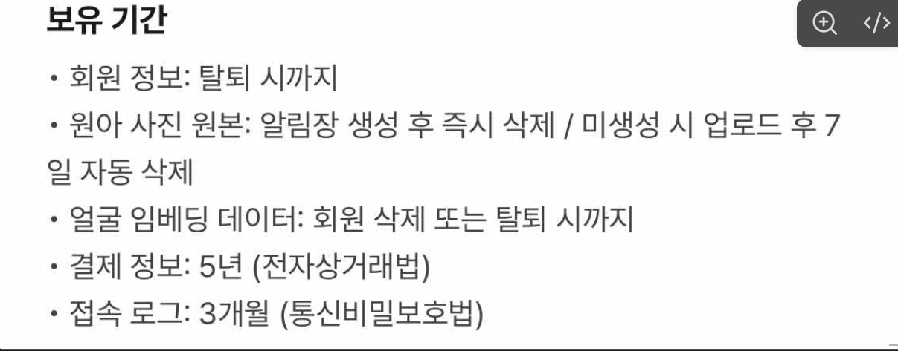
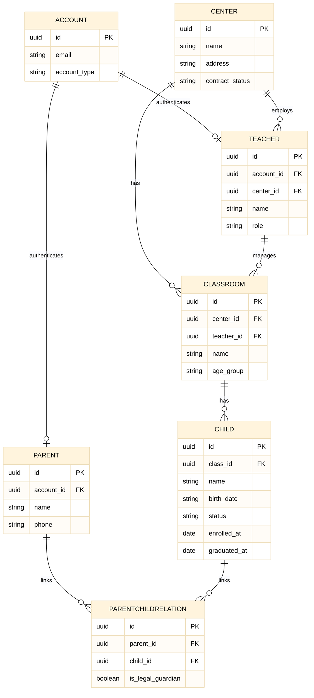
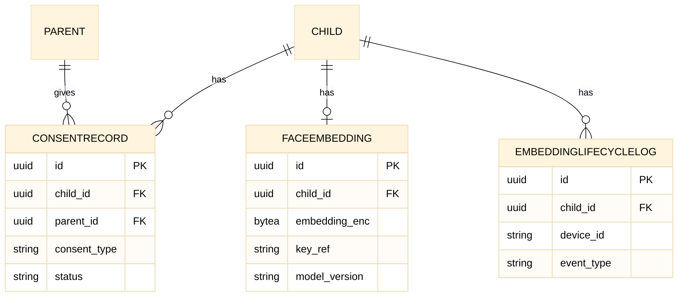
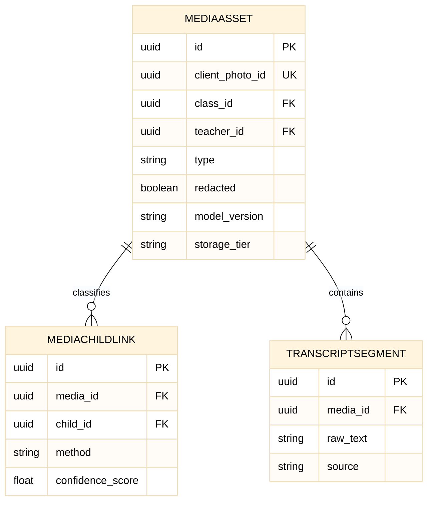
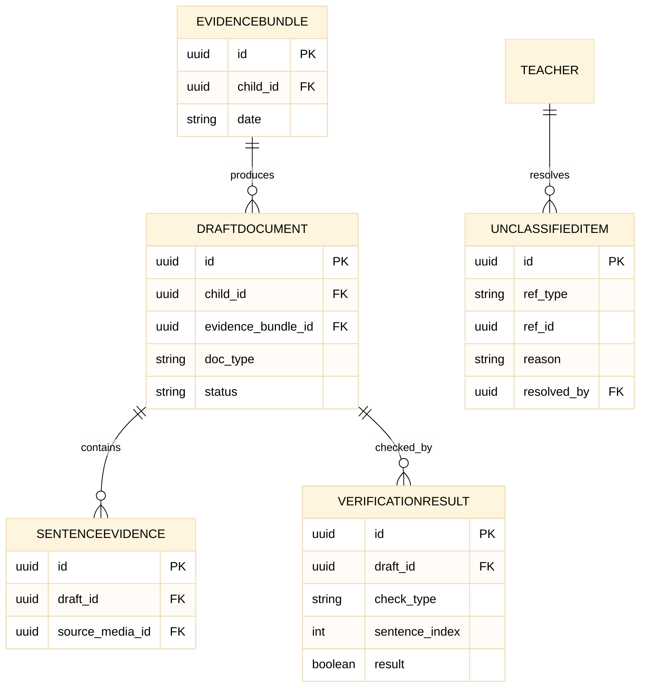
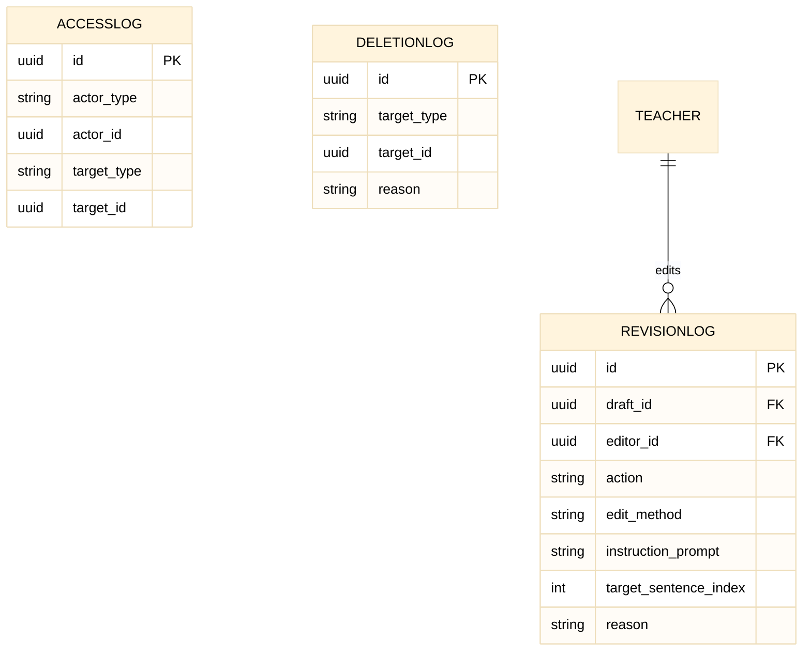
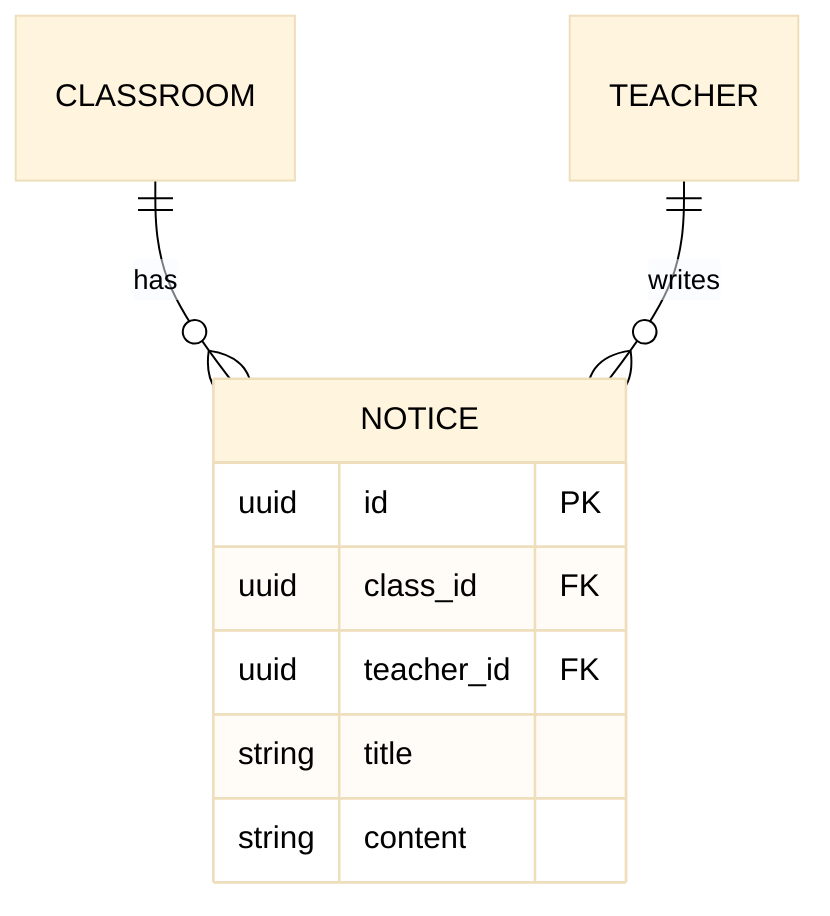
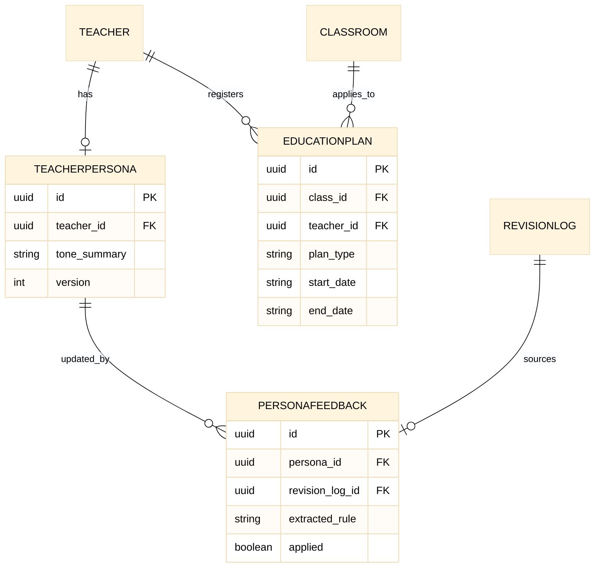
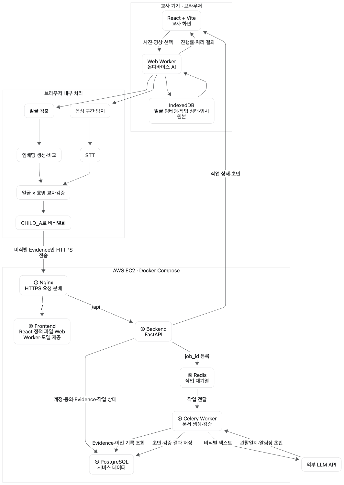
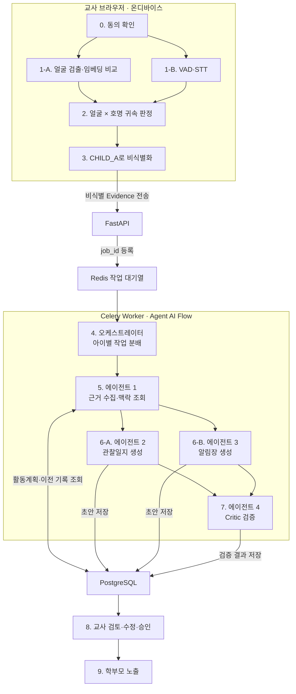

# 테크스펙

<aside>
💡

1. 노란색을 제외한 요소들은 선택사항입니다.
2. 핵심요소라고 해서 무조건 작성하는 것은 아닙니다.
3. 다른 요소를 추가하셔도 됩니다.
</aside>

**아이담** — 영상·사진·음성녹음 속 맥락을 수집해 원아의 하루를 담아내는 AI 알림장·관찰일지 자동 작성 서비스

### [‣](https://app.notion.com/p/23f2bb98425783d6820b81579a00b2a1?pvs=21)

# 배경

<aside>
💡

왜 이 기능을 만드는지, 어떤 사용자 문제를 해결하려 하는지 등

</aside>

**타겟 사용자** — 국공립 어린이집 담임교사(만 3세반, 원아 6명 담당)

**현재 업무 방식과 비용**

| 방식 | 소요 | 한계 |
| --- | --- | --- |
| 낮잠 시간에 미리 작성 | 30~60분 | 교실 정리·다음 활동 준비·휴게가 밀리고, 아이가 깨면 중단되어 대부분 끝내지 못함 |
| 퇴근 후 몰아 작성 | 사진 분류 30~50분 + 문서 작성 40~60분 (하루 1~2시간) | 그 시점엔 대화·상황에 대한 기억이 이미 흐릿함 |
- 하루 촬영량: 사진·영상 100~150장
- 병목은 사진 개수가 아니라, 촬영 순간의 맥락이 퇴근 무렵 휘발된다는 점
- 해결 대상: 관찰은 낮에 이미 끝났는데 그것을 기록으로 옮기는 데만 퇴근 후 1~2시간이 추가로 드는 구조

# 목표

<aside>
💡

예상 가능한 결과들

</aside>

- 검토 시간의 감소: 퇴근 후 1~2시간 → 15~20분
- 수정 없이 승인하는 비율 60% 이상
- 관찰일지·알림장 문서 2종 동시 생성
- 기록 작성 시간을 아이 돌봄 시간으로 바꿀 수 있음이 확인됨
- 초안에 문장별 근거(원문 발화)를 붙여 **신뢰도 확보**

# 일정

<aside>
💡

프로젝트 시작부터, 기획, 디자인, 개발, QA, 릴리즈 일정 등 모든 일정

</aside>

### 현재 자세한 내용은 미정. 내용은 최종 기획안에서 추출. 개발일정이 수업 일정에 따라 좌우되는 만큼. 오래 대화해서 정하거나, 유동적으로 바꾸는게 좋을듯…

| 기간 | 내용 |
| --- | --- |
| 아이디어톤 기간 | 문제 정의·프로토타입·에이전트 워크플로우 확정 |
| 1-2주 | 소음 환경 STT 검증, 교사 8~12명 인터뷰 |
| 3-4주 | 어린이집 3곳 이상 방문, 1곳 파일럿 합의 확보 |
| 5-6주 | 얼굴·호명 교차검증 테스트케이스 통과율 측정 |
| 7-8주 | 프로토타입 실사용 피드백 수집 |
| 9-10주 | 주 3일 이상 재사용률 측정 |
| 파일럿 이후 | 매칭 정확도·톤·예외처리 개선. 이전 기록 조회 범위를 3~6개월치로 확대해 발달 흐름을 시계열로 제공하는 방향 검토(발달 판정은 Won't 유지) |

# 담당

<aside>
💡

프로젝트를 담당하고 있는 모든 인원

</aside>

| 이름 | 팀 역할 | 프로젝트 역할 |
| --- | --- | --- |
| 정은 (팀장) | PM | BE, FE |
| 김진하 | PM | FE, AI |
| 김동건 | 평가·QA | BE, FE |
| 이한나 | 평가·QA | BE, FE |
| 한상균 (AI 리드) | 통합 | BE, AI |
| 송유진 (FE 리드) | 통합 | FE, AI |
| 엄태은 (BE 리드) | 발표·스토리 | BE, AI |

# 요구사항

<aside>
💡

기능적, 비기능적 요구사항으로 나누어 생각

</aside>

! 법적인 요구사항이 채워져야합니다! (원아 얼굴 사진 활용 등 측면. 현재는 간단히 논의만 되었고 유사사이트의 법령만 확인된 상태)

### 전제조건

서비스에 포함되지 않기에, 미리 가정해야하는 내용을 서술합니다.

- 교사는 서비스에 등록할 원아의 법정대리인을 통해 별도 동의를 받아야함
 (자녀 개인정보 수집·이용, 얼굴 특징정보 처리, 원 활동 사진·영상 촬영 및 공유 동의, 기존에 촬영된 원아사진 활용동의(가칭))
- 학부모는 위의 동의를 거부가능

## 기능

### **must**

(없으면 서비스가 성립하지 않음)

| ID | 요구사항 | 사유/비고 |
| --- | --- | --- |
| FR-01 | 교사는 원아의 동의 미동의 여부를 등록가능하다 |  |
| FR-02 |  |  |
| FR-03 | 교사는 동의를 하지 않은 원아를 확인가능 |  |
| FR-04 | 사진·영상 업로드 후 아이별 자동 분류 (얼굴 인식 + 호명 발화 교차검증) |  |
| FR-05 | 사용자의 음성메모와 영상내 추출된 음성 내용을 맥락으로 사용하여 알림장과 관찰일지 초안을 작성  ← 비기능으로 |  |
| FR-06 | 관찰일지(격식체)·알림장(다정한 톤) 이중 초안 생성 |  |
| FR-07 | 사용자는 일지의 문장별 분류 근거를 확인가능 (근거 = 영상 시각 + 원문 발화) |  |
| FR-08 | 교사가 승인하지 않은 일지는 저장·복사·노출되지 않음 |  |
| FR-09 | 학부모는 열람 전용 화면을 통해 원아의 일지를 조회가능(과거 일지 까지) |  |
| FR-13 | 학부모와 선생님 중 선택해서 로그인이 가능함 |  |
| FR-14 | 아이별로 분류되지 못한 사진은 선생님이 수동 분류 가능 |  |
| FR-15 | 선생님은 pc 로컬 스토리지의 사진/동영상을 업로드 할 수 있음 |  |
| FR-16 | 교사는 담당반에서 작성한 모든 일지에 접근가능함 | 0903 추가 |
| FR-17 | 교사는 작성된 초안의 특정 부분을 직접 수정 가능 | 0903 추가 |
| FR-18 | 교사는 작성된 초안의 수정 요청을 프롬프트와 함께 제시할 수 있음 | 멘토님 지적사항 + 09/01 회의 언급 |
| FR-19 | 비승인된 작성된 초안은 ?시간동안 보존됨 | AI 지적 |
| FR-20 | 교사는 초안에 반영할 월간/주간 교육계획 등록할 수 있음 | AI 지적 |
| FR-21 | 교사는 등록한 월간/주간 교육계획을 조회 가능함 | AI 지적 |
| FR-22 | 교사는 원아의 동의를 철회 상태로 변경할 수 있고, 철회 시 해당 원아의 얼굴 임베딩은 즉시 삭제된다 | 09/11 추가. 동의 철회권 대응 |
|  |  |  |

## should

(있어야 제대로지만 없어도 돌아감 ⇒ 추후 고려)

| ID | 요구사항 | 사유/비고 |
| --- | --- | --- |
|  | 모바일 웹환경에서 원활한 이용가능. | 09/01 회의 언급 |
|  | 선생님이 촬영한 사진/영상이 실시간으로 처리및 서버에 전송(앱으로 구현 필요) | 09/01 회의 언급 |
| FR-10 | 학부모는 원아의 사진, 영상을 다운로드 가능함 | 서비스로서의 완성도. must → should (09/11) |
| FR-11 | 선생님은 학부모가 확인할수 있는 공지를 게시판에 등록가능함 | 서비스로서의 완성도. must → should (09/11) |
| FR-12 | 학부모는 선생님이 게시한 공지를 게시판에서 확인가능 | 서비스로서의 완성도. must → should (09/11) |
|  | 선생님은 자신이 발행한 관찰일지와 알림장을 수정가능함 | AI 지적사항.(근데 없어도 일단 돌아갈것 같음) |

## could

(있으면 좋음.)

| ID | 요구사항 | 사유/비고 |
| --- | --- | --- |
| 비기능 | 촬영된 라이브 포토가  생성된 초안에 반영됨 | 09/01 회의 언급 |
| 기능 | 유저는 모바일 앱을 통해 라이브 포토를 찍을 수 있음 | 09/01 회의 언급 |

### Won`t

- 학부모가 아이담을 통해 선생님에게 의견을 전달 할 수 있음
사유 : 필수 구현사항에 해당하지 않음

## 비기능

| ID | 요구사항 | 사유/비고 |
| --- | --- | --- |
| NFR-01 | 얼굴 임베딩은 암호화해 서버에 저장되며, 동의 없는 원본 얼굴 사진은 LLM에게 보내지 않는다. | 법 저촉 위험, 09/01 회의 내용 반영 |
| NFR-02 | (상세내용 미정)사진, 영상, 음성 메시지 정보를 추출하여 서버에 전송하는 속도가 UX를 해치지 않음 — 근거: 하루 촬영량이 사진·영상 100~150장이라 업로드 구간이 UX 병목이 될 수 있음 (멘토 지적).  | 사용자 경험 개선 |
| NFR-03 | 원아의 사진은 졸업 후 1년까지 제공되며 이후 파기됨. 기한 기준값은 `Child.graduated_at`, 산출 결과는 `MediaAsset.retention_expires_at`. | 서버비와 사용자 경험(내 아이의 추억이 사라졌어)의 균형 맞추기 |
| NFR-04 | 영구 저장은 교사 승인본만. 미승인 원본은 처리 후 즉시 파기하고 파기 로그 보관 |  |
| NFR-05 | 모든 열람에 접근 로그(누가·언제·무엇을) 기록 |  |
| NFR-06 | 승인 플래그 검사 없이 저장·전송 함수 호출 금지 |  |
| NFR-07 | 생성된 알림장과 학습일지는 선생님의 페르소나를 반영한다.  |  |
| NFR-08 | 생성된 알림장과 관찰일지는 선생님의 음성과 영상 속 발화를 반영한다 |  |
| NFR-09 | 생성된 알림장과 관찰일지는 아이의 영상과 사진의 맥락을 반영함. |  |
| NFR-10 | 선생님이 직접 수정지시한 초안의 방향성은 선생님의 페르소나의 반영이됨 | 09/01 회의 내용 반영 |
| NFR-11 | 선생님의 요청으로 재작성된 초안은 선생님의 지적사항이 반영되어야함 | 멘토님 지적사항 + 09/01 회의내용 반영 |
| NFR-12 | 생성된 알림장과 관찰일지는 등록된 월간/주간 교육계획을 반영함 |  |

### 

## 예외 처리

- 매칭된 사진·발화가 없는 아이: "오늘 OO의 활동 기록이 아직 없어요" 안내 + 직접 입력 버튼 제공
- 신뢰도가 낮은 항목: 자동 승인하지 않고 교사가 직접 확인·결정
- 아이 안전·건강 등은 AI가 작성하지 않음

학부모용 화면

- 동의 → 사진 등록
- 열람 화면(공지, 알림장, 앨범, 일정, 식단 등)

# 아키텍처 설계

<aside>
💡

전체적인 구조와 흐름 등을 도식화

</aside>

## 처리 파이프라인

| 단계 | 처리 주체 | 처리 내용 | 산출물 | 참고한 요구사항 |
| --- | --- | --- | --- | --- |
| 0. 등록 임베딩 캐시 조회 | 코드(서버 필터링) + 온디바이스(캐시)  | 배치 시작 시 서버가 **담당 반의 재원 원아 중 동의가 유효하고 임베딩이 등록된 원아**의 기준 임베딩만 브라우저로 전달. 동의 수집은 앱 외부(서면)지만 철회 시 임베딩을 즉시 삭제하므로(FR-22) 평소 두 조건은 같은 집합임. 그럼에도 **조회는 동의 레코드와 임베딩을 함께 확인**함 — 철회 처리가 중간에 실패해 임베딩이 남더라도 미동의 원아가 대조 대상에 들어가지 않도록, 두 값이 어긋나면 **제외되는 쪽으로 실패**시키기 위함. 등록된 원아라도 임베딩이 없으면 대상에서 빠짐. 브라우저는 이번 배치 동안만 메모리에 캐시. 임베딩 조회 실패 시 처리 중단 | 이번 배치용 기준 임베딩 캐시 |  |
| 1. 근거 수집 (얼굴·음성 병렬) | 온디바이스 모델 (코드가 호출)
 | Silero VAD 발화 구간 탐지 → whisper-base STT / MediaPipe BlazeFace 얼굴 검출 → ArcFace 임베딩 / frame_extract 근거 프레임 선택. 음성 실패 시 "멘트 없음", 얼굴 실패 시 미분류함 | 발화 텍스트, 얼굴 임베딩, 근거 프레임 | NFR-02. 온디바이스를 선택한 이유 |
| 2. 귀속 판정 | 코드 (규칙 기반) | 얼굴 인식 결과와 발화 속 호명을 대조. 신뢰도 임계값 미달·충돌 시 자동 결정하지 않음 | 아이별 귀속 결과, 미확정 건은 미분류함 |  |
| 3. 비식별화 | 코드 (서버 경계) | 아이 실명을 토큰으로 치환 (이름 → CHILD_A) | 비식별화된 텍스트 |  |
| 4. 오케스트레이터 | 코드 | 아이 단위로 근거를 묶어 에이전트1에 전달. 재시도 상한 2회, 타임아웃 60초 관리 | 아이별 Evidence 묶음 |  |
| 5. 에이전트1 — 근거 수집 | LLM + tool | 발화 내용에 따라 tool 호출 (활동계획 조회 / 이전 기록 조회 / 원아 명단 조회). **해당 아이의 사진도 근거에 포함**(NFR-09) — 발화가 1차, 사진은 맥락 보강. 사진은 S3의 `MediaAsset` 원본을 서버가 읽어 전달(별도 사본 없음). 근거 부족 시 재호출, 그래도 부족하면 미분류함 | 조합된 근거 묶음(비식별 텍스트 + 사진) |  |
| 6. 에이전트2·3 — 초안 생성 | LLM + tool (병렬) | 에이전트2: 영역 스타일 조회(표준보육과정 6대 영역)·발달 지침 조회 → 관찰일지. 에이전트3: 아이 감정 어휘 조회·발달 문안 조회 → 알림장 | 관찰일지·알림장 초안 2종 |  |
| 7. 에이전트4 — 검증(Critic) | LLM (별도 컨텍스트) | 근거 대조(문장별 타임스탬프·원문 존재 확인), 금지어 검사, 타 아이 언급 감지, 영역 스타일 검사. 두 문서 모두 필수 통과. 실패 시 재생성, 상한 초과 시 미분류함 | 검증 통과 초안 |  |
| 8. 교사 검토·승인 | 교사 | 근거 클릭 시 원본 영상 구간 3초 재생. 최종 확인 체크박스로 승인 | 승인된 최종 문서 |  |
| 9. 학부모 노출·학습 저장 | 코드 | 아이-학부모 매칭 테이블 대조 후 노출, 매칭 실패 시 자동 취소. 수정 이력 최근 5회 저장, 미분류함·수정 내역을 다음 판단에 반영. 24시간 이내 회수 가능(열람 후에는 회수 불가) | 전달된 문서, 학습 데이터 |  |

### (아래 내용은 AI워크플로우 외의 사용흐름을 지금까지 작성내용으로 AI에게 요청해서 뽑은 겁니다. 참고해서 수정해주세요)

## 흐름 구분

<aside>
💡

위 '처리 파이프라인'은 아래 C 흐름에 해당합니다. 요구사항 FR-01~03, FR-09~12, NFR-03~05는 파이프라인 밖의 별도 흐름에 담깁니다.

</aside>

| 흐름 | 트리거 | 빈도 | AI 관여 |
| --- | --- | --- | --- |
|  |  |  |  |
| B. 원아 얼굴 등록 | 교사의 원아 얼굴 사진 업로드 | 원아당 1회 | 임베딩 생성만 |
| C. 일지 생성 (위 처리 파이프라인) | 교사의 촬영분 업로드 | 매일 | 있음 |
| D. 학부모 열람 | 승인본 노출 이후 | 상시 | 없음 |
| E. 공지 게시판 | 교사의 공지 등록 | 비정기 | 없음 |
| F. 보관·파기 | 스케줄 / 파이프라인 종료 | 배치 | 없음 |

### B. 동의·얼굴 등록 흐름 (원아당 최초 1회)

| 단계 | 처리 주체 | 처리 내용 | 산출물 | 참고한 요구사항 |
| --- | --- | --- | --- | --- |
| B-1 | 교사 | 계정 로그인 | - |  |
| B-2 | 교사 | 임베딩용 사진 업로드 | 원아 등록 사진 |  |
| B-3 | 온디바이스 모델 | 얼굴 임베딩 생성 후 서버(FaceEmbedding)에 저장 | 원아 임베딩 인식정보 |  |
| B-4 | 코드 | 동의 상태를 원아 단위로 저장. 처리 파이프라인 0단계(동의확인 게이트)의 조회 대상 | 동의 대장 | FR-03, 처리 파이프라인 0단계 |
| B-6 | 교사 | 첫 화면에서 미동의 원아 확인 | - | FR-03, 요구사항 메모 2 |
|  |  |  |  |  |

### C. 일지 생성 흐름 — 업로드 구간 (처리 파이프라인 0단계 이전)

| 단계 | 처리 주체 | 처리 내용 | 참고한 요구사항 |
| --- | --- | --- | --- |
| C-0 | 교사 | 오늘 촬영분(사진·영상 100~150장) 및 음성메모 업로드 | 시나리오 2, NFR-02, FR-05 |
| C-1 | 코드 | 업로드 진행·처리 단계 상태 표시 | 시나리오 3 |
| C-2 | 코드 | 업로드 중 앱 종료·타임아웃 시 실패한 단계만 재실행 | 오류 복구 표 |
| → |  | 이후 처리 파이프라인 0~9단계 |  |

### D. 학부모 열람 흐름

| 단계 | 처리 주체 | 처리 내용 | 참고한 요구사항 |
| --- | --- | --- | --- |
| D-1 | 코드 | 승인 플래그 검사 후 노출. 미승인 문서는 저장·복사·노출 금지 | FR-08, NFR-06 |
| D-2 | 학부모 | 열람 전용 화면에서 원아 일지 조회 | FR-09 |
| D-3 | 코드 | 열람 시 접근 로그 기록 (누가·언제·무엇을) | NFR-05 |
| D-4 | 학부모 | (미정) 원아 사진·영상 다운로드 | FR-10 |
| D-5 | - | 학부모→교사 의견 전달 경로 없음 | MUST NOT, 스펙 아웃 |
| D-6 | 교사 | 노출 후 24시간 이내 회수. 열람 후에는 회수 불가 | 처리 파이프라인 9단계 |

### E. 공지 게시판 흐름

<aside>
💡

AI 파이프라인을 타지 않는 독립 경로. 동의확인 게이트·비식별화·Critic 검증을 거치지 않습니다.

</aside>

| 단계 | 처리 주체 | 처리 내용 | 참고한 요구사항 |
| --- | --- | --- | --- |
| E-1 | 교사 | 공지 본문 직접 작성 후 게시판에 등록 | FR-11 |
| E-2 | 코드 | 게시판에 저장·노출. (미정) 게시 범위(반 단위/원 단위), 수정·삭제 가능 여부, 학부모 알림 발송 여부 | FR-11 |
| E-3 | 학부모 | 게시판에서 공지 확인 | FR-12 |
| E-4 | 코드 | 열람 접근 로그 기록 | NFR-05 |
| E-5 | - | 공지 본문 AI 생성 없음, 댓글 없음 | 스펙 아웃, MUST NOT |

### F. 보관·파기 흐름

| 단계 | 처리 주체 | 처리 내용 | 참고한 요구사항 |
| --- | --- | --- | --- |
| F-1 | 코드 | 교사 승인본만 영구 저장 | NFR-04 |
| F-2 | 코드 | 미승인 원본은 처리 직후 파기, 파기 로그 보관 | NFR-04 |
| F-3 | 코드 | 원아 사진은 졸업 후 1년까지 제공, 이후 파기 (`retention_expires_at` = `graduated_at` + 1년). (미정) 그 기간 안에서 원본 → 저화질 전환 시점 | NFR-03 |
| F-4 | 코드 | 수정 이력 최근 5회 저장 | 처리 파이프라인 9단계 |

### 공통 규칙 (전 흐름 적용)

- 승인 플래그 검사 없이 저장·전송 함수 호출 금지 (NFR-06) — C·D·E 흐름 해당
- 모든 열람에 접근 로그 기록 (NFR-05) — D·E 흐름 해당
- 미동의 원아가 함께 찍힌 사진은 **로컬에서 그 얼굴을 블러 처리한 뒤 업로드**하고, 해당 원아는 귀속·일지 대상에서 제외합니다 (FR-04, 처리 파이프라인 0단계) — B·C 흐름 해당
  <!-- 09/12 블러 처리로 결정. LocalPhoto.excluded_reason=미동의포함(전송 자체 제외) 경로와 루트 CLAUDE.md H-3 문구가 이 결정과 맞는지 한 번 더 확인할 것 -->

### 결정 필요 사항들(이긴한데 나머지다 세부 구현사항 내용이에요)

<aside>
💡

현재 문서에 근거가 없어 채우지 않은 항목입니다. 상상해서 채우지 말고 논의로 확정할 것.

</aside>

- 얼굴 임베딩의 저장 위치 (B-4) — 0903 논의로 서버 저장(FaceEmbedding)으로 결정. 리스크 표·데이터 모델에 반영 완료
- 반 편성·연도 전환 — 담당 반이 바뀔 때 동의·매칭·기록 접근 권한 승계 방법 미기재

## 책임 분담

| 구분 | 범위 |
| --- | --- |
| 코드 (규칙 기반) | 동의확인 게이트, 귀속 판정, 비식별화, 오케스트레이션, 학부모 노출 |
| AI 에이전트 | 얼굴·발화 인식(전처리), 근거 수집·맥락 조회, 초안 생성, 검증(Critic) |
| 교사 | 미분류함 확인, 최종 검토·승인 |

# 

# 데이터 모델

> **필드 이름·타입·제약의 최종 근거는 `backend/domains/*/models.py`와 Alembic 마이그레이션입니다.**
> 코드가 생긴 뒤 이 문서와 갈리면 코드가 맞습니다. 이 섹션은 **설계 의도와 엔티티 관계**를 위해 유지합니다
> — 어떤 요구사항 때문에 그 필드가 있는지는 코드에 적히지 않습니다.
> 스키마를 바꿀 때는 마이그레이션을 먼저 쓰고 이 문서를 갱신합니다. 다만 **요구사항(FR/NFR) 변경은 반대로 이 문서가 먼저입니다.**

<aside>
💡

필요한 DB구조, 필드 정의 등

</aside>

**이 섹션을 처음 보신다면 이 순서로 읽어주세요**

1. 아래 요약(상세 변경 이력) — 수정 사항
2. ①~⑥ 그룹별 표 + 관계도(그림) — 표가 기준, 그림은 참고용
3. 필드 하나하나의 뜻이 궁금하면 → 데이터 사전 페이지(아래 링크)
- 최종 기획안 / 기능 요구사항 기준으로 AI가 만든 데이터베이스 구조 초안을 만든 뒤, 멘토 피드백과 팀 논의를 반영해 아래 표를 **최신 버전으로 갱신**했습니다.
- 상세 변경 이력:
    
    [DB 구조 수정 사항 — (핵심)얼굴 임베딩 온디바이스 전환](https://app.notion.com/p/DB-ebb64086fccd82118ece0171feb6300f?pvs=21)
    
- 필드별 자세한 설명:
    
    [데이터 사전 — 필드별 설명](https://app.notion.com/p/79564086fccd837eacb201dfd43f811a?pvs=21)
    
- Claude에 노션 MCP를 추가하고 개인 페이지에 테크스펙 사본을 만든 다음, DB 모델을 설명해달라고 요청하면 표와 관계도(그림)으로 친절하게 설명해줘서 이해하기 쉽습니다. (추천!)

---

### ① 조직 · 사용자

| 엔티티 | 필드 | 설명 |
| --- | --- | --- |
| Account(로그인 계정) | id, email, password_hash, account_type | account_type: teacher / parent. 교사·학부모 모두 이 테이블로 로그인(FR-13 근거) |
| Center(원) | id, name, address, contract_status | contract_status: 체험/정식 계약 상태 |
| Class(반) | id, center_id, teacher_id, name, age_group | 예: 만3세반. teacher_id로 담당 교사 참조 (반은 항상 교사 1명) |
| Teacher(교사) | id, account_id, center_id, name, role | role: 담임/원장. 교사 1명이 여러 반을 담당할 수 있음(1:M). 한 반을 여러 교사가 함께 맡는 경우는 계정 공유로 처리(N:M 설계 불필요) |
| Child(원아) | id, class_id, name, birth_date, status, enrolled_at, graduated_at | status: 재원/졸업/퇴소. graduated_at은 졸업·퇴소 확정일로, NFR-03의 "졸업 후 1년" 보관 기한 계산 기준값(MediaAsset.retention_expires_at 산출에 사용). 재원 중에는 null |
| Parent(학부모) | id, account_id, name, phone | account_id로 로그인 계정 참조 |
| ParentChildRelation(학부모 - 아이 매칭) | id, parent_id, child_id, is_legal_guardian | 학부모 열람 화면(FR-09) 매칭에 사용.  매칭 실패 시 빈 화면 반환(5-1) |
|  |  |  |

> 다이어그램 도구(mermaid) 예약어 충돌로 Class 대신 Classroom으로 표기됨 (실제 테이블명은 Class 그대로 사용)
> 

### ② 동의 · 개인정보 (수정 필요)

> ✅ **결정 (0903 팀 논의)**: 선생님 기기가 바뀌거나 고장 나면 등록된 얼굴 정보가 전부 유실되는 안정성 문제 때문에, 얼굴 임베딩 벡터를 서버(FaceEmbedding)에 저장하는 것으로 되돌렸습니다.
> 

| 엔티티 | 필드 | 설명/비고 |
| --- | --- | --- |
| ConsentRecord(학부모(법정대리인) 동의 기록 | id, child_id, parent_id, consent_type, status, agreed_at, revoked_at | consent_type: 개인정보수집이용 / 얼굴특징정보처리 / 활동사진영상촬영 동의 여부(사전 동의여부). 법적 요구사항 문구는 요구사항 섹션 상단 이미지 기준으로 확정 필요 |
| FaceEmbedding(얼굴 임베딩) | id, child_id, embedding_enc, key_ref, model_version, registered_at, updated_at | 임베딩 벡터를 애플리케이션 레벨 AES 암호화 후 `bytea`로 저장. 암호화 키는 DB 외부(KMS/시크릿 매니저)에 보관. 유사도 계산은 담당 반 재원·동의 원아만 조회해 메모리에서 수행하므로 pgvector 등 벡터 인덱스는 사용하지 않음. 기기 분실·고장 시에도 재등록 없이 복구 가능 |
| EmbeddingLifecycleLog(생체정보 처리 이력) | id, child_id, device_id, event_type, created_at | event_type: register/re_register/device_change/device_revoked/**consent_revoked**(FR-22). device_id는 별도 참조 테이블 없이 식별값만 문자열로 기록. 벡터 값은 절대 포함하지 않는 순수 감사 로그 |

> **얼굴 임베딩 벡터는 서버 DB(FaceEmbedding)에 암호화되어 저장됩니다.** 브라우저 LocalFaceStore(IndexedDB)는 배치 처리 동안만 쓰는 임시 캐시이며, 영구 저장소가 아닙니다.
> 

### ③ 원본 미디어 · 인식 결과 (파이프라인 0~2단계)

| 엔티티 | 필드 | 설명/비고 |
| --- | --- | --- |
| MediaAsset(교사가 촬영해서 올린 원본 파일) | id, client_photo_id, class_id, teacher_id, type, captured_at, storage_url, storage_tier, redacted, model_version, retention_expires_at | client_photo_id는 클라이언트가 생성한 UUID로 UNIQUE 제약. 네트워크 실패로 재전송돼도 중복 저장되지 않음(`ON CONFLICT DO NOTHING`). redacted: 미식별 얼굴이 있어 로컬에서 블러 처리된 파일인지. model_version: 로컬 분류에 쓰인 모델 버전(교사 기기마다 다를 수 있음). storage_url의 객체 하나를 학부모 열람·다운로드(FR-09/10)와 초안 맥락 추출(NFR-09) 양쪽이 공유한다. 용도별 사본을 만들지 않는다. storage_tier: original/degraded/deleted. 보관 기한은 졸업 후 1년으로 확정(NFR-03, retention_expires_at). (미정) 기한 안에서 원본 → 저화질 전환 시점과 저화질 보관 방식(카카오톡 참고) |
| MediaChildLink(사진-아이 매칭 결과) | id, media_id, child_id, method, confidence_score | 교사 검수를 마친 확정 결과만 기록. 미분류·미검수 상태는 로컬에만 존재하며 서버로 전송되지 않음. method: face_name_cross_check(로컬 자동)/manual(로컬 수동). 미식별 얼굴이 함께 찍힌 경우 로컬에서 블러 후 업로드되며, 해당 인물의 행은 생성되지 않음 |
| TranscriptSegment(영상 속 음성 stt 텍스트화 결과) | id, media_id, start_time, end_time, raw_text, source | source: video_audio/voice_memo. 음성 인식 실패 시 raw_text = "멘트 없음" |

### ④ 초안 생성 · 검증 (파이프라인 3~7단계)

| 엔티티 | 필드 | 설명/비고 |
| --- | --- | --- |
| EvidenceBundle(한 아이의 하루치 근거) | id, child_id, date, media_refs, transcript_refs, context_lookup | 에이전트1 산출물. context_lookup: 활동계획/이전기록/원아명단 조회 결과 요약 |
| DraftDocument(EvidenceBundle을 바탕으로 실제 생성된 문서 - 아이 한 명을 기준으로 알림장/일지 2건 생성) | id, child_id, evidence_bundle_id, doc_type, content, status, created_at, approved_at | doc_type: `observation_log`(관찰일지)/`parent_note`(알림장). status: draft→verified→approved. **status가 unclassified가 되면 UnclassifiedItem에 ref_type=draft인 행이 함께 생성됩니다**, FR-06 |
| SentenceEvidence(DraftDocument안의 문장 하나하나가 어떤 근거에서 나왔는지 연결) | id, draft_id, sentence_index, source_media_id, source_timestamp, source_text | 문장별 근거(FR-07). 근거 클릭 시 원본 영상 3초 재생에 사용 |
| VerificationResult(파이프라인 7단계 Critic에이전트가 초안을 검증하는 로그) | id, draft_id, check_type, sentence_index, result, detail, checked_at | check_type: 근거대조/금지어/타아이언급/영역스타일. 근거대조·금지어·타아이언급은 sentence_index로 문장 단위 기록, 영역스타일은 문서 전체라 null. 관찰일지·알림장 모두 필수 통과 |
| UnclassifiedItem(서버 처리 중 교사 확인이 필요해진 항목) | id, ref_type, ref_id, reason, status, resolved_by, resolved_at | reason: 발화없음/검증실패/근거부족. 서버 도달 이후 발생한 사유만 기록. 얼굴미매칭·신뢰도낮음 등 업로드 전 판정 사유는 로컬(LocalPhoto.classify_state)에서 관리되며 서버로 전송되지 않음. 교사 화면에서는 로컬 항목과 병합해 단일 "확인 필요" 목록으로 표시 |

> ref_type/ref_id는 여러 테이블 중 아무거나를 가리키는 폴리모픽 참조라 화살표로 연결하지 않았습니다.
> 

### ⑤ 승인 · 노출 · 로그 (파이프라인 8~9단계)

| 엔티티 | 필드 | 설명/비고 |
| --- | --- | --- |
| RevisionLog(교사가 초안을 수정할 때마다 남는 이력) | id, draft_id, editor_id, action, edit_method, instruction_prompt, target_sentence_index, reason, before_content, after_content, created_at | action: edit/approve/revoke/resend. edit_method: manual(교사가 직접 타이핑, FR-17)/prompt(교사가 요청문을 주고 AI가 재작성, FR-18). instruction_prompt는 edit_method=prompt일 때만 채워지는 교사 요청문 원문으로, NFR-11(지적사항 반영 확인)과 NFR-10(페르소나 갱신)의 원천 데이터. target_sentence_index: 특정 문장만 수정한 경우 그 위치, 문서 전체 수정이면 null. reason: 문체다듬기/사실이다름(추가지표의 사실 오류 측정에 사용). 최근 5회 보관(5-3) |
| AccessLog(누가/언제/무엇을 열람했는지 접근 기록) | id, actor_type, actor_id, action, target_type, target_id, created_at | NFR-05: 모든 열람에 접근 로그(누가·언제·무엇을) 기록 |
| DeletionLog(원본이 파기될 때 남는 삭제 이력) | id, target_type, target_id, reason, deleted_at | NFR-04: 미승인 원본 즉시 파기 + 파기 로그 보관 |

> AccessLog와 DeletionLog는 actor_id/target_id가 여러 테이블 중 아무거나를 가리키는 폴리모픽 참조라 화살표 없이 독립 테이블로만 표시했습니다.
> 

### ⑥ 미정 기능 관련

| 엔티티 | 필드 | 설명/비고 |
| --- | --- | --- |
| Notice(공지) | id, class_id, teacher_id, title, content, created_at | FR-11/12(should) — 구현 확정 시 AccessLog 연동(학부모 열람 확인용) 필요 |

### ⑦ 교사 페르소나 · 교육계획

| 엔티티 | 필드 | 설명/비고 |
| --- | --- | --- |
| TeacherPersona(교사 문체 프로필) | id, teacher_id, tone_summary, style_rules, sample_phrases, version, updated_at | 생성 문서에 반영할 교사 개인의 어투·표현 특성(NFR-07). tone_summary: 프롬프트에 주입할 요약 문장. style_rules: 즐겨 쓰는 표현·피하는 표현 등 규칙 목록. version: 갱신마다 증가, 이전 버전은 이력으로 보존 |
| PersonaFeedback(페르소나 갱신 근거) | id, persona_id, revision_log_id, extracted_rule, applied, created_at | 교사의 수정 지시·수정 결과에서 추출한 문체 신호(NFR-10, NFR-11). RevisionLog를 원천으로 참조하며, applied=true인 항목만 다음 version에 반영 |
| EducationPlan(월간/주간 교육계획) | id, class_id, teacher_id, plan_type, start_date, end_date, title, content, created_at | plan_type: monthly/weekly. 교사가 직접 등록·조회(FR-20, FR-21). 초안 생성 시 date 범위로 조회해 EvidenceBundle.context_lookup에 주입(NFR-12) |

# ⑧ 로컬 저장소 (브라우저 IndexedDB)

> **IndexedDB는 관계형 DB가 아닙니다.** 키-값 기반 객체 저장소로 외래키 제약과 조인이 없으며, 관계는 코드에서 인덱스로 조회해 이어붙입니다. DB가 참조 무결성을 보장하지 않으므로 ERD로 표기하지 않고 객체 구조로만 정의합니다. `candidates`, `assigned_child_ids`를 별도 테이블로 쪼개지 않고 JSON으로 품은 것도 같은 이유입니다.
> 
> 
> 서버와 연결되는 지점은 `photo_id`(→ `MediaAsset.client_photo_id`) 하나입니다.
> 

> ⚠️ **현재 정의는 사진(photo) 처리만을 염두에 둔 구조입니다.** 영상·음성 메모의 로컬 처리 방식은 아직 결정되지 않았으며, 확정 후 이 섹션에 반영해야 합니다. 상세는 아래 "미결" 참조.
> 

### LocalBatch (촬영 묶음)

| 필드 | 타입 | 설명 | 예시 |
| --- | --- | --- | --- |
| batch_id | UUID | 클라이언트 생성 |  |
| source_label | 문자열 | 교사가 붙인 이름 | "9/4 바깥놀이" |
| total_count | 숫자 | 이 배치의 사진 수 | 150 |
| state | 문자열(열거형) | 배치 진행 상태 | `분류중` / `검수중` / `전송중` / `완료` |
| created_at | 날짜시간 | 생성 시각 |  |

### LocalPhoto (사진 1장)

분류·검수·전송 세 축이 독립적으로 움직입니다. 단일 status로는 "분류는 됐으나 미검수"와 "분류 실패"를 구분할 수 없습니다.

| 필드 | 타입 | 설명 | 예시 |
| --- | --- | --- | --- |
| photo_id | UUID | 클라이언트 생성. 서버 client_photo_id로 그대로 전송 |  |
| batch_id | UUID | 소속 배치 |  |
| blob | 바이너리 | 원본. 전송 확인 후 삭제 |  |
| blob_redacted | 바이너리 | 블러 처리본. 미식별 얼굴 있을 때만 생성 |  |
| captured_at | 날짜시간 | 촬영 시각 |  |
| model_version | 문자열 | 분류에 쓴 모델 버전 | `buffalo_l-1.0` |
| classify_state | 문자열(열거형) | 자동 분류 결과 | `pending` / `classified` / `unclassified` / `failed` |
| candidates | JSON | 후보 아이와 신뢰도 | `[{"child_id":"...","confidence":0.92}]` |
| has_unidentified_face | 참/거짓 | 식별되지 않은 얼굴이 프레임에 있는지 | `true` / `false` |
| review_state | 문자열(열거형) | 교사 검수 상태 | `미검수` / `확정` / `제외` |
| assigned_child_ids | JSON(배열) | 교사가 최종 확정한 아이 | `["uuid1","uuid2"]` |
| excluded_reason | 문자열(열거형) | 제외 사유 | `미동의포함` / `부적절` / `기타` |
| upload_state | 문자열(열거형) | 전송 상태 | `대기` / `전송중` / `확인됨` / `실패` |
| attempt_count | 숫자 | 재시도 횟수 | 2 |
| server_media_id | UUID | ack로 받은 서버 id |  |

### 미결 — 영상·음성 메모의 로컬 처리

위 구조는 사진 기준입니다. 3축 상태·멱등 키·전송 게이트 원칙은 영상·음성에도 그대로 적용되나, 타입별 차이가 정해지지 않았습니다.

**영상** —ex) 얼굴 분류를 어느 프레임에서 할지(대표 1장/샘플링/전체), 미식별 얼굴이 있을 때 처리 방식(영상 전체 제외/구간 편집/프레임 블러), 브라우저 재인코딩 부담, 조각 전송(10MiB 이상) 필요 여부

**음성 메모** —ex) 검수 대상 여부, 귀속 단위(개별 아이/반 전체), 전송 게이트 적용 여부

**공통** — 한 배치에 타입 혼재 허용 여부, 일지 생성 트리거 기준

영상의 로컬 블러는 브라우저에서 재인코딩이 필요해 부담이 큽니다. 범위 축소(촬영 시 운영 지침으로 대체, 또는 should 하향)도 함께 검토합니다.

# 인터페이스 명세

> **저장소 미반영 — Claude는 아래 Notion 링크를 읽을 수 없습니다.** API를 설계할 때 이 내용을 안다고 가정하지 말고 질문하세요. (작성 담당: 송유진)
> 코드가 생긴 뒤에는 **`/docs`의 OpenAPI가 계약의 원본**입니다. 엔드포인트 목록을 여기에 손으로 유지하지 않고, 제출용이 필요하면 그 시점에 export합니다.

<aside>
💡

요청/응답 구조, 프론트 개발자들이 필요한 예시가 포함 된 스펙

</aside>

## [‣](https://app.notion.com/p/3cb2bb9842578003bdeafc1193216569?pvs=21)

# 화면별 필요 데이터

> 피그마 화면 기준으로 작성했습니다. 일부 수정 필요합니다!
> 

## 역할 선택

1. 역할 구분 (교사 / 학부모)
2. 기존 계정 여부

## 로그인

1. 이메일·비밀번호 검증 결과
2. 로그인 상태 유지 여부
3. 세션 쿠키
4. 로그인 후 이동할 곳 (온보딩 미완료 / 홈)

## 교사 계정 만들기

1. 이름·이메일·비밀번호
2. 어린이집 코드 검증 결과
3. 코드로 확인된 어린이집 이름
4. 이용약관·개인정보 처리방침 동의 여부
5. 가입 결과와 다음 단계

## 온보딩 1 — 반 만들기

1. 코드로 확인된 어린이집 이름
2. 반 이름
3. 연령 구분 (만 0~2세 표준보육과정 6영역 / 만 3~5세 누리과정 5영역)
4. 우리 반 원아 수
5. 연령에 따른 영역 목록

## 온보딩 2 — 원아 명단

1. 원아 수만큼의 이름 입력칸
2. 등록 결과 (원아 식별자 목록)

## **온보딩 3 — 얼굴 등록**

1. 원아 목록 (이름, 이니셜)
2. 원아별 법정대리인 동의 상태 (교사가 서면 동의 결과를 등록한 값, FR-01)
3. 원아별 등록된 사진 수
4. 등록 완료 인원 / 전체 인원
5. 동의 미등록 인원 수
6. 원아별 얼굴 등록 가능 여부 (동의 없으면 잠김)
7. 등록할 얼굴 임베딩 (사진 원본 아님)
8. 몇 명으로 시작할지

> 앱에서 학부모에게 동의를 요청하지 않습니다. 동의 수집은 전제조건(서면)이고,
> 이 화면은 교사가 등록한 상태를 보여주고 구분만 합니다.

## **홈**

1. 교사 이름
2. 오늘 날짜
3. 반 정보 (이름, 연령, 원아 수)
4. 오늘 기록 건수 (이미지 / 영상 / 음성기록)
5. 검토 대기 건수
6. 확인 필요 건수
7. 미분류함 건수
8. 정리 대기 중인 촬영분 건수
9. 진행 중인 배치 식별자·상태
10. 오늘 일정 (시각, 활동명, 현재 진행 표시)
11. 촬영 리마인더 배너 (통계에서 설정한 것)

## **오늘 찍은 것 올리기**

1. 지원 포맷 목록 (사진 JPG·PNG·HEIC / 영상 MP4·MOV / 녹음 M4A·WAV)
2. 업로드 대상 저장 위치 (presigned URL)
3. 파일별 식별자 (재개 업로드용)
4. 촬영시각 (브라우저가 EXIF에서 추출해 전달)
5. 파일 종류·크기
6. 파일별 진행률과 상태 (완료 / 진행 중 / 대기)
7. 파일별 처리 단계 문구
8. 전체 진행 (143개 중 96개)
9. 남은 시간 추정
10. 업로드 실패 항목과 사유
11. 휴대폰에서 보내기(QR) 세션

## **정리 시작 전 확인**

1. 분류한 전체 건수
2. 처리할 수 있는 건수
3. 처리하지 않는 건수
4. 촬영 중 음성 사용 동의 여부
5. 정리 시작 결과

## **처리 중 — 파이프라인**

1. 단계 4개 식별자와 순서 (동의 확인 / 얼굴·목소리 읽기 / 누구 것인지 정하기 / 초안 쓰기)
2. 단계별 상태 (완료 / 진행 중 / 대기)
3. 단계별 요약 수치
4. 현재 단계 진행률
5. 충돌 건수 / 미분류 건수
6. 실시간 판정 로그 (원아명, 판정 결과, 경고 여부)
7. 이벤트 순번 (연결 끊김 후 이어받기용)

## **확인 필요 — 귀속 충돌**

1. 충돌 건수와 현재 순번
2. 근거 영상 재생 URL (H.264 프록시본)
3. 영상 활동명·촬영시각·길이
4. 얼굴 인식 결과 (원아명)
5. 멘트 속 이름
6. 근거 클립 (시각 + 발화 원문)
7. 후보 원아 2명과 각각의 근거 사유
8. 확정 결과 / 미분류함으로 보내기
9. 남은 충돌 건수

## **초안 검토**

1. 반 원아 목록 (이름, 이니셜, 검토 완료 여부)
2. 현재 원아 순번 / 전체
3. 검토 완료 건수
4. 초안 시각·활동명·근거 영상 개수
5. 초안 본문 (관찰일지 / 알림장)
6. 근거 클립 목록 (시각 + 발화 원문 + 재생 URL)
7. 누리과정 영역 태그
8. 문서 검증 상태
9. 이전·다음 원아
10. 근거 없어 제외된 문장 목록

## **승인 확인 (모달)**

1. 승인 대상 원아명
2. **승인 전에 조회하는** 실행 예정 동작 목록 — 모달에 [더 볼게요]가 있어 취소 가능
3. 동작별 라벨과 서술 문구 (알림장 1건 / 학부모 게시판에 업로드 돼요)
4. 승인 가능 여부
5. 승인 결과
6. 회수 가능 기한
7. 승인 실패 사유 코드

## **알림장 올리기**

1. 승인된 초안 수 / 전체 원아 수
2. 원아별 항목 (이름, 상태, 요약 문장)
3. 항목별 선택 가능 여부와 불가 사유
4. 선택 개수
5. 학부모 미리보기 (제목, 날짜, 반, 사진, 본문)
6. 사진 처리 안내 (다른 아이 얼굴 가림 / 근거 영상 미포함)
7. 일괄 업로드 결과 (건별 성공·실패)

## **관찰일지**

1. 주차 정보 (주차 라벨, 기간)
2. 전체 건수 / 승인 완료 건수
3. 원아별 행 (이름, 날짜, 누리과정 영역, 상태)
4. 상태 값 (승인 완료 / 초안) — **버튼은 이 값으로 갈린다**
5. 일부 초안에만 붙는 사유 문구 (영역 태그 자리에 대신 표시. 사유 없는 초안도 있다)
6. 검토하기로 이동할 초안 식별자
7. 주차별 내보내기 요청·결과 (평가제 제출용 서식)

## **미분류함**

1. 미분류 전체 건수
2. 사유별 그룹과 건수 (멘트 없음 / 뒷모습·측면 / 맥락 불일치)
3. 항목별 사유 라벨
4. 항목 썸네일 URL
5. 지정 가능한 원아 목록
6. 이미 지정한 원아
7. 지정 결과와 남은 건수
8. "이 사진은 안 쓸게요" 처리 결과
9. 다음 분류 반영 여부

## **아이들**

1. 반 정보 (연령, 이름, 원아 수)
2. 얼굴 등록 완료 인원
3. 이번 주 전체 기록 건수
4. 원아별 카드 (이름, 이니셜, 이번 주 기록 건수)
5. 기록이 적은 원아 표시 여부
6. 원아 명단 관리 진입

## **앨범**

1. 날짜
2. 전체 장수
3. 아이별 탭과 건수 (전체 / 원아별 / 미분류)
4. 항목별 썸네일 URL
5. 항목별 원아명·촬영시각
6. 단체 사진 표시와 가려진 얼굴 수

## **통계**

1. 원아 정보 (이름, 반, 주차 기간)
2. 요약 (기록 건수, 사진·영상 개수, 비어 있는 영역 수)
3. 누리과정 5영역별 기록 수
4. 영역별 반 평균 대비 차이
5. 비어 있는 영역 안내 문구
6. 힌트 식별자와 현재 알림 설정 상태 (켜짐 / 꺼짐)
7. 내일 촬영 때 알려주기 등록·해제 결과
8. 이번 주 기록 목록 (날짜, 활동명, 영역, 근거 클립)

## **학부모 (미정)**

1. 접근 방식 — 초대코드·SMS 인증 여부
2. 자녀 정보 (이름, 반)
3. 날짜별 알림장 목록 (승인·업로드분만)
4. 알림장 본문
5. 사진 URL (만료되는 서명 URL)
6. 업로드 시각
7. 회수 여부
8. 답글 기능 여부

# 온디바이스 AI 모델 인터페이스

| 모델 | 입력 | 출력 | 비고 |
| --- | --- | --- | --- |
| Silero VAD (`@ricky0123/vad-web`) | 오디오 스트림(마이크 또는 영상 오디오 트랙, 16kHz PCM) | 발화 구간 목록 `[{start_ms, end_ms}]` | 무음 구간 제외, 발화 있는 구간만 STT로 전달 |
| whisper-base STT (`@huggingface/transformers`) | VAD가 잘라낸 오디오 구간 파형 버퍼 | {text, start_ms, end_ms, confidence} | 인식 실패 시 `text = "멘트 없음"` |
| BlazeFace 얼굴 검출 (`@mediapipe/tasks-vision`) | 이미지 프레임(사진 원본 또는 영상 프레임) | 얼굴 bounding box 목록 `[{x, y, w, h, confidence}]` | 식별 없이 위치만 반환. 매칭 실패한 얼굴도 이 박스 좌표로 blur 처리 |
| ArcFace 임베딩 (ONNX + `onnxruntime-web`) | BlazeFace가 찾은 얼굴 crop 이미지 | 512차원 임베딩 벡터 | 기준 임베딩 캐시와 코사인 유사도 비교에만 사용, 매칭 후 즉시 폐기 |
| frame_extract (Canvas API) | 영상 + 타임스탬프 | 해당 시점 프레임 이미지 | 문장별 근거 표시(FR-07)에 사용 |

# 에이전트 Tool 호출 스펙

| Tool | 호출 에이전트 | 입력 | 출력 |
| --- | --- | --- | --- |
| 활동계획 조회 | 에이전트1 | `class_id`, `date` | 오늘의 활동명·시간대 목록 |
| 이전 기록 조회 | 에이전트1 | `child_id`, 조회 기간 | 이전 관찰일지·알림장 요약 |
| 원아 명단 조회 | 에이전트1 | class_id | 원아 이름·이니셜 목록(호명 매칭용) |
| 영역 스타일 조회 | 에이전트2 | age_group | 표준보육과정/누리과정 문체 가이드 |
| 발달 지침 조회 | 에이전트2 | `age_group`, `domain` | 연령별 발달 지침 문구 |
| 감정 어휘 조회 | 에이전트3 | 상황 키워드 | 아이 감정 표현용 어휘 목록 |
| 발달 문안 조회 | 에이전트3 | age_group | 알림장용 발달 문안 템플릿 |

---

# 리스크

<aside>
💡

개발뿐 아니라 프로젝트 전체에서 예상되는 리스크와 대응 방안

</aside>

| 리스크 | 심각도 | 대응 방안 |
| --- | --- | --- |
| 아동 개인정보·안전장치 부재 | 상 (최대 리스크) | 얼굴 임베딩은 서버(FaceEmbedding, 암호화)에 저장, 원본 얼굴 사진은 서버 미전송 및 LLM에는 비식별 텍스트만 전달, 미동의 아동 규칙적 제외, 위탁계약서·동의서 사전 준비 |
| 원장 승인 없이는 도입 자체가 불가 | 상 | 인터뷰에 응한 교사를 통한 내부 소개 경로 확보 |
| 소음 환경 STT 정확도 미검증 | 중 | 1주차에 80dB 교실 소음 환경에서 STT 실측, 데모에 실제 소음 환경 영상 포함 |
| "이미 상용화된 조합"이라는 인상으로 공개 시 역풍 | 하 | 공개 범위를 UI·컨셉까지로 제한, 소음 STT 파라미터·수정이력 데이터는 비공개 |

## 오류 복구

| 오류 유형 | 증상 | 복구 방법 |
| --- | --- | --- |
| 아이 간 오배정 | A 아이의 사진·발화가 B 아이 초안에 포함 | 교사가 '사실이 다름'으로 수정 후 재반영 |
| 사실과 다른 내용 | 없던 일을 쓰거나 상황을 잘못 서술 | 문장 단위 수정·삭제, 사진 교체 및 해당 문장 재작성 |
| 파이프라인 중간 실패 | STT·얼굴인식·LLM 호출 실패, 업로드 중 앱 종료, 타임아웃 | 실패한 단계만 재실행. 재시도 상한 초과 시 해당 항목은 수동 처리 |

# 요청사항

<aside>
💡

각 담당자들에게 질문과 요청 / 결정사항 등을 정리하고 공유

</aside>

이 위치에는 저희가 이전 회의하면서 상의했던 내용들 적어 두겠습니다

**1. 목표 문구 수정 — "학부모의 기록" 표현**

- 원문의 마지막 문장이 "학부모가 문장별 근거를 확인한다"는 의미로 오독될 수 있어 논의됨.
- 실제 의도는 학부모가 아니라 **교사가 문장별 근거를 확인**하는 것으로 합의.
- 근거는 알림장뿐 아니라 관찰일지에도 쓰이므로, **"초안의 신뢰도 확보"** 로 수정.
- 담당: 정은

**2. 초안 작성의 입력 소스 — 영상/음성 기반으로 확정**

- 기존 문구의 "사진 시각"에 대한 해석이 팀원마다 달라 논의됨(사진 메타데이터 시각 / 영상 발화 시점의 장면).
- 사진에서 행동·활동을 추출해 초안에 반영하는 방식은 정확도가 낮을 것으로 판단.
- 타 서비스는 교사가 초안용 텍스트를 직접 작성하는 방식이나, 본 서비스는 그 작성 자체가 기억에 의존하는 부담이라 보고 **현장 녹음으로 대체**하는 것을 차별점으로 설정.
- ~~결론: 초안 작성은 영상/음성 기반. 사진은 아동별 자동 분류 용도로만 사용하며 초안 작성 근거에는 포함하지 않음.~~
- **결론 수정 (2026-09-11): 사진도 초안 근거에 포함합니다.** 영상·음성 발화가 1차 근거이고, 사진은 맥락 보강용입니다 (NFR-09 유지).
- **결정 (2026-09-12): 동의받은 원아의 사진은 이미지 그대로 LLM에 전달합니다.** 미동의 원아 얼굴은 업로드 전 로컬에서 블러 처리되므로(공통 규칙), 서버에서 LLM으로 나가는 사진에는 미동의 얼굴이 없습니다 (NFR-01, H-2·H-3).
- **S3에 올라간 `MediaAsset` 원본을 그대로 씁니다. 맥락 추출용 사본을 따로 만들지 않습니다.** 같은 객체가 학부모 열람·다운로드(FR-09/10)와 초안 근거(NFR-09) 양쪽에 쓰입니다. LLM 전달은 서버가 S3에서 읽어 보냅니다 — 브라우저가 LLM으로 직접 보내지 않습니다.
- 관련 문구인 "사진 시각"은 목표 항목에서 제거 (반영 완료).
- **미정: 영상에서 중간 프레임을 몇 장 골라 사진처럼 다룰지.** 파이프라인 1단계에 `frame_extract 근거 프레임 선택`이 이미 있으나, 그 프레임을 초안 근거로 쓸지·몇 장 뽑을지·선택 기준은 논의 중입니다.

<!-- 09/11 재논의. 사진을 근거에서 빼면 NFR-09와 충돌하고, 발화가 적은 날 근거가 비게 됨 -->

**3. 목표 지표 문구 수정 — 초안 편집률**

- 기존: "초안 편집률 40% 이하 (교사가 수정 없이 승인하는 비율)" → 지표명과 괄호 설명의 방향이 불일치.
- 수정: **"수정 없이 승인하는 비율 60% 이상"**

**4. 개인정보 동의 처리 범위**

- 조사된 동의 유형: 생체인식정보 활용 동의(임베딩 서버 저장), 사진/영상 활용 동의(학부모 수령), 개인정보 활용 동의.
- 유사 앱 확인 결과, 앱이 학부모에게 직접 동의를 받는 구조가 아니라 **교사가 사용 전 학부모 동의를 받고 사용하는 방식**.
- 확인 결과, 유치원 내 사진을 임베딩에 사용하는 부분에 한해 추가 동의를 요청하면 가능.
- **결론: 동의 수집·요청 절차만 앱 외부(서면, 교사↔학부모)로 뺍니다.** 전제조건 참고.
    - 교사가 서면 동의 결과를 앱에 등록하고(FR-01), 시스템은 그 상태로 원아를 구분합니다(FR-03). **이 두 기능은 유지됩니다.**
    - 앱이 학부모에게 동의를 요청하는 기능은 스펙 아웃 (온보딩 3의 "동의 요청 보내기" 제거).
- 이에 따라 학부모가 앱에서 직접 동의·거부하는 요구사항을 삭제(FR-02 자리). 하위 문서가 ID로 참조하므로 **공란을 그대로 두고 재정렬하지 않습니다. 빈 ID를 새 요구사항에 재사용하지 마세요.**

<!-- 2026-09-11 수정: 기존 문구가 "구분 로직 제외"로 읽혀 FR-01/FR-03까지 삭제 대상으로 오해됨.
     빠진 것은 동의를 '받는' 절차뿐이고 '등록·구분'은 남는다는 점을 명시. -->

**5. 기관 도입 관련 내용 제외**

- 서비스 확장계획에서 파생된 기관 도입 관련 서술은 앱 외부 기능으로 판단하여 스펙에서 제외.

**6. 데이터 모델 / 인터페이스 설계**

- 작성 진행 중.
- 인터페이스 명세는 **프론트엔드 관점에서 필요한 데이터를 우선 기준**으로 작성. (담당: 송유진)

### 후속 확인 필요

- 요구사항 ID 공란 처리 후 전체 문서 참조 일괄 재정렬.
- 사진을 초안 근거에서 제외함에 따라, 영상/음성 파일이 없는 상황에서의 서비스 동작 정의.
- 단체사진 업로드 시 처리 방식(전원 동의 전제로 둘지 여부).

# 기술스택

- FE (미정)

| **영역** | **선택** | 역할 |
| --- | --- | --- |
| 프레임워크 | React + TypeScript + Vite | 화면 렌더링, 타입 검사, 개발 서버·번들 |
| 라우팅 | React Router | 화면 이동과 진입 조건 제어 |
| 클라이언트 상태 | Zustand  | 업로드 큐 보관 
(파일 목록·진행률·재시도) |
| 스타일 | Tailwind + shadcn/ui | 공용 스타일과 기본 컴포넌트 제공 |
| 폼·검증 | React Hook Form + zod | 폼 입력 관리와 값 검증 |
| 서버 상태 | TanStack Query | 서버 데이터 조회·캐시·재시도·갱신 |
| API 타입 | openapi-typescript | BE의 OpenAPI에서 
TypeScript 타입 자동 생성 |
| API 목킹 | MSW
(Mock Service Worker) | BE 없이 API 응답을 흉내 내는 
개발·테스트용 가짜 서버 |
- BE (미정)

| 영역 | 선택 | 역할 |
| --- | --- | --- |
| 언어 | Python | 백엔드와 LLM 처리 구현 |
| API 프레임워크 | FastAPI | 프론트엔드 요청 처리 |
| 실행 서버 | Uvicorn | FastAPI 실행 |
| 데이터 검증 | Pydantic | API 요청·응답 형태 검사 |
| ORM | SQLAlchemy | Python 코드에서 PostgreSQL 사용 |
| DB 마이그레이션 | Alembic | DB 구조 변경 기록 및 적용 |
| 데이터베이스 | PostgreSQL | 계정·동의·Evidence·초안·승인 저장 |
| 작업 대기열 | Redis | FastAPI가 생성한 비동기 작업 전달 |
| 비동기 프레임워크 | Celery | Worker 실행, 재시도, 작업 분배 |
| 외부 API 통신 | HTTPX | LLM API 호출 |
| 인증 | 세션 쿠키 또는 JWT | 교사·학부모 로그인 |
| 비밀번호 | Argon2 또는 bcrypt | 비밀번호 단방향 암호화 |
| 테스트 | pytest | API·권한·작업 흐름 자동 테스트 |
| 배포 | Docker Compose | EC2에서 컨테이너 관리 |
| 리버스 프록시 | Nginx | HTTPS와 요청 경로 분배 |
| CI/CD | GitHub Actions | 테스트 후 EC2 자동 배포 |
- AI (미정)

| **영역** | **선택** | **왜 이걸 골랐나** |
| --- | --- | --- |
| LLM (에이전트1·2·3) | Claude Sonnet 계열 | tool-calling 정확도와 한국어 문어체(관찰일지)·다정한 톤(알림장) 동시 제어가 필요해서 |
| LLM (에이전트4, Critic) | 에이전트1~3과 동일 계열, 별도 세션으로 호출 | "같은 컨텍스트에서는 자기 실수를 못 본다"는 설계 전제를 지키려면 모델은 같게, 세션만 분리하면 충분 |
| 에이전트 오케스트레이션 | 프레임워크 없이 직접 구현 (Celery task chain/group) | 파이프라인 단계(4→5→6·7 순차/병렬)가 이미 명확히 정의돼 있어 LangGraph 등 없이도 표현 가능. 비동기 설계를 더 늘리지 않는 방향 |
| Tool calling | LLM 제공사 네이티브 function calling | 별도 tool-calling 라이브러리 불필요 |
| 프롬프트·Tool 정의 관리 | 코드 저장소 내 `prompts/` 디렉토리, git으로 버전관리 | 팀 규모상 별도 프롬프트 관리 툴은 과함 |
| 관측·트레이싱 | Langfuse (셀프호스팅) | 테스트 전략의 "경로 판정"(도구 호출 로그 확인) 요건을 그대로 기록. LangChain 비의존, SDK 단독 연동 |
| 음성 구간 탐지 (VAD) | `@ricky0123/vad-web` | Silero VAD를 브라우저에서 그대로 실행하는 검증된 래퍼 |
| STT (온디바이스) | `@huggingface/transformers`(구 transformers.js)의 whisper-base | 브라우저에서 ONNX로 whisper-base 실행, WASM 백엔드 |
| 얼굴 검출 | `@mediapipe/tasks-vision` (Google 공식 MediaPipe) | 스펙에 명시된 BlazeFace를 공식 SDK로 브라우저에서 실행 |
| 얼굴 임베딩 | ArcFace ONNX 모델 + `onnxruntime-web` | 공식 JS 패키지가 없어 ONNX로 변환한 모델을 직접 추론 |
| 임베딩 저장·비교 | PostgreSQL + 별도 추가 계산 | 반당 원아 6명 규모라 별도 벡터DB(Pinecone 등) 불필요. DB에서 반의 원생의 임베딩 정보만 조회 후 복호화하여 사용 |
| 근거 프레임 선택 | Canvas API 기반 자체 구현 | 타임스탬프 기준 프레임 캡처만 하면 돼서 별도 라이브러리 불필요 |
- 배포 ( Docker 컨테이너)

| 번호 | 컨테이너 | 역할 |
| --- | --- | --- |
| 1 | `nginx` | HTTPS 요청을 받고 프론트와 백엔드로 분배 |
| 2 | `frontend` | React 화면, Web Worker, 브라우저용 AI 모델 제공 |
| 3 | `backend` | FastAPI API, 인증·권한·동의·Evidence·승인 처리 |
| 4 | `postgres` | 사용자·동의·작업·초안·승인·로그 저장 |
| 5 | `redis` | 처리해야 할 문서 생성 작업을 줄 세움 |
| 6 | `worker` | Celery로 관찰일지·알림장 생성 및 Critic 검증 |

- 기술 처리 흐름 → 근데 제가 비동기 처리에 욕심을 많이 부려서 꼭 덜어내는 작업이 필요할 것 같습니다.
- 위에는 전체적인 흐름이고, 아래는 Agent Workflow 내용이 조금 추가되었습니다. 두번째 이미지가 좀 더 정확한 설명이 될 것 같습니다.
- Worker, Redis 등을 넣은 이유는 저희가 이미지/영상/음성 처리 & 초안 생성 등에 시간이 많이 걸릴듯 하여 비동기 프로그래밍에 대한 것들을 알아보다가 넣어봤습니다.

 

# 시나리오

<aside>
💡

사용자 관점에서의 흐름이나 주요 동작

</aside>

1. **얼굴 등록 (최초 1회)** — 얼굴 식별을 위해 아이들의 얼굴을 등록한다
2. **촬영분 업로드** — 오늘 찍은 사진·영상을 업로드한다
3. **AI 처리 중 화면** — 현재 처리 단계를 실시간으로 표시한다 (예: "얼굴 인식 중...", "초안 작성 중...")
4. **모호한 근거 확인** — 아이가 명확하지 않은 사진·영상만 골라 교사에게 확인을 요청한다 (초안 생성에 필요한 추가적인 코멘트를 작성 가능하다)
5. **초안 확인** — 자동 선택된 사진·근거와 함께 생성된 초안을 보여준다
6. **수정·승인** — 교사가 내용을 수정하고 승인한다
7. **완료** — 승인된 알림장은 업로드되고, 관찰일지는 저장된다

# 트레이드오프

<aside>
💡

기술이나 구현/기획에 있어서 고민했던 내용

</aside>

- **얼굴 인식만 vs 얼굴 + 호명 교차검증** — 동명이인·충돌 상황의 분류 정확도를 위해 호명 발화까지 교차검증하는 방식을 선택
- **의도적 음성메모 vs 활동 중 발화 자동 포착** — 교사가 따로 남긴 메모가 아니라 활동 중 흘러나온 발화까지 자동으로 포착하고, 문장별 근거를 붙이는 방식을 선택
- **단일 문서 vs 이중 문서 생성** — 같은 근거로 관찰일지와 알림장을 동시에 생성
- **검증 에이전트를 별도 컨텍스트로 분리** — 같은 컨텍스트 안에서는 자기 실수를 못 보기 때문에 다른 컨텍스트로 분리해 검증
- **B2C vs B2B** — 아동 얼굴·음성 처리는 기관 동의가 있어야 켜지는 구조이며 원장 승인 없이는 도입 자체가 막히므로 기관 단위 도입을 선택

# 테스트 전략

<aside>
💡

유닛/통합/QA 등 방식을 정하고 테스트에 필요한 환경도 구성

</aside>

- **STT 실측** — 80dB 교실 소음 환경에서 정확도 측정 (1주차)
- **귀속 판정** — 얼굴·호명 교차검증 테스트케이스 통과율 측정 (5-6주)
- **경로 판정** — 얼굴인식·STT·LLM·매칭 네 도구의 호출 로그를 확인. 필요한 도구가 전부 호출되어야 통과하며, 결과가 맞아도 도구를 거치지 않았다면 가장 위험한 실패로 간주
- **실사용 검증** — 프로토타입 피드백 수집(7-8주), 주 3일 이상 재사용률 측정(9-10주)

# 릴리즈

<aside>
💡

릴리즈에 필요한 내용 정리 / 일정과 합쳐도 무방

</aside>

**도입 경로**

1. 국공립 어린이집 1곳에 도입
2. 해당 어린이집 담임교사 5~6명 확보
3. 어린이집 단위로 확장

**과금**

- B2B, 어린이집 단위 도입. 어린이집당 월 구독료 형태를 가설로 설정
- 파일럿 기간에는 무료 또는 할인 제공 후 정식 계약으로 전환
- 정확한 금액은 파일럿 기간 중 원장·교사 대상 지불 의향 조사로 확정

# 스펙 아웃

<aside>
💡

이번 기획에 포함 되었지만 어떠한 이유로 스펙아웃 된 내용 정리

</aside>

- 사진·영상 자동 보정·편집(필터 등)
- 학부모에게 자동 발송(교사 승인 없이)
- 학부모-교사 양방향 소통(댓글 등)
- 월간·주간 활동계획 생성
- 전체 학부모 공지사항 작성
- 학부모용 별도 앱
- 키즈노트 자동연동
- 발달 판정
- 아동 화자식별

# 히스토리

<aside>
💡

기획/디자인/개발 하면서 검색하고 참고했던 자료

</aside>

- 프로토타입(피그마): [카테캠 아이디어톤 충남대 4팀 메이크](https://www.figma.com/design/sQfGACGClaBSKW51s4NYry/%EC%B9%B4%ED%85%8C%EC%BA%A0%EC%95%84%EC%9D%B4%EB%94%94%EC%96%B4%ED%86%A4-%EC%B6%A9%EB%82%A8%EB%8C%80-4%ED%8C%80-%EB%A9%94%EC%9D%B4%ED%81%AC?node-id=175-430&p=f&t=eLNVWr02ri1yaIhu-0)
- [키즈노트 매일 작성 지쳐요](https://cafe.naver.com/yuasam/959829) — 네이버 카페. 매일 사진 꾸미기 + 동영상 편집까지, 하루 종일 폰 붙잡고 지침
- [교사를 사진가로 만드는 학부모 알림장 민원](https://www.sisain.co.kr/news/articleView.html?idxno=42796) — 시사IN. 담임 교사가 낮잠 시간을 이용해 알림장을 작성한다는 교사 기고문
- [키즈노트 '업무보호' 기능, 24만명 이용했다](https://www.etnews.com/20260813000357) — 전자신문(2026.8.13). 퇴근 후 업무 부담을 공식 인정한 알림 차단 기능, 교사 24만 명 사용
- [키즈노트가 만든 요즘 유치원 현실](https://www.youtube.com/shorts/xzZrx-VDTH4) — 유튜브 숏츠. 일과 중에도 아이를 돌보며 아이마다 사진을 찍어야 하는 상황

# 추가 지표

<aside>
💡

프로젝트에서 수집해야 될 값들

</aside>

| 구분 | 지표 | 측정 방법 | 판정 기준 |
| --- | --- | --- | --- |
| 효율 | 무수정 승인율, 검토 소요시간 | 문장 단위 수정 여부 기록. 초안 확인 화면 진입 → 승인까지 시간 측정 후 기존 방식과 비교 | 검토 15~20분 이내, 수정 없이 승인하는 비율 60% 이상 |
| 품질 | 사실 오류 건수(삭제·정정한 문장 수) | 수정 시 사유를 `문체 다듬기` / `사실이 다름` 중 선택 | 아이 1명당 __건
승인율이 오르는데 사실 오류도 함께 오르면 교사가 검토를 포기한 것으로 판단 |
| 경로 판정 | 도구 호출 | 얼굴인식·STT·LLM·매칭 네 도구의 호출 로그 확인 | 필요한 도구가 전부 호출되어야 통과 |
| 재사용 | 주 3일 이상 재사용률 | 9-10주차 측정 | - |